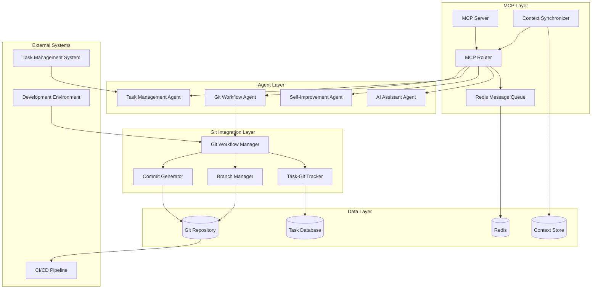

# MCP and Git Integration - Design Document

## Overview

This design document outlines the architecture for implementing a robust Model Context Protocol (MCP) system and automated Git workflow integration. The design builds upon the existing MCP router and Git integration components while adding comprehensive message handling, context synchronization, and automated task-based version control.

The system will provide seamless communication between AI agents through standardized MCP protocols while ensuring all development work is automatically tracked and committed to Git with proper documentation and traceability.

## Architecture

### High-Level Architecture



## Components and Interfaces

### 1. Enhanced MCP Server

**Purpose:** Central MCP server that manages all agent communication with Redis backend

**Key Responsibilities:**
- Implement full MCP protocol specification
- Manage agent connections and authentication
- Route messages based on agent capabilities and message types
- Handle connection failures and reconnection logic
- Provide message persistence and delivery guarantees

**Interface:**
```python
class MCPServer:
    async def start_server(self, host: str, port: int) -> bool
    async def stop_server(self) -> None
    async def register_agent(self, agent_id: str, capabilities: List[str]) -> str
    async def unregister_agent(self, agent_id: str) -> bool
    async def route_message(self, message: MCPMessage) -> bool
    async def broadcast_message(self, message: MCPMessage, target_type: str) -> int
    async def get_server_status(self) -> ServerStatus
```

### 2. MCP Message Handler

**Purpose:** Standardized message processing and validation for MCP protocol

**Key Responsibilities:**
- Validate MCP message format and structure
- Implement message type routing and filtering
- Handle message serialization and deserialization
- Provide message acknowledgment and error handling
- Support message batching and compression

**Interface:**
```python
class MCPMessageHandler:
    def validate_message(self, message: Dict[str, Any]) -> ValidationResult
    def serialize_message(self, message: MCPMessage) -> bytes
    def deserialize_message(self, data: bytes) -> MCPMessage
    def route_message(self, message: MCPMessage) -> List[str]
    def create_error_response(self, error: Exception, original_message: MCPMessage) -> MCPMessage
```

### 3. Context Synchronization Engine

**Purpose:** Manage context sharing and synchronization between agents via MCP

**Key Responsibilities:**
- Broadcast context updates to relevant agents
- Handle context conflicts and resolution
- Maintain context versioning and history
- Implement context compression and optimization
- Provide context query and retrieval capabilities

**Interface:**
```python
class ContextSynchronizer:
    async def broadcast_context_update(self, context: AgentContext, targets: List[str]) -> bool
    async def sync_agent_context(self, agent_id: str, context: AgentContext) -> bool
    async def resolve_context_conflict(self, conflicts: List[ContextConflict]) -> ContextResolution
    async def get_shared_context(self, agent_id: str, context_type: str) -> AgentContext
    async def subscribe_to_context_updates(self, agent_id: str, callback: Callable) -> str
```

### 4. Git Workflow Manager

**Purpose:** Automated Git operations integrated with task lifecycle management

**Key Responsibilities:**
- Create and manage feature branches for tasks
- Generate meaningful commit messages with task context
- Handle merge conflicts and branch management
- Integrate with task completion workflows
- Provide Git operation rollback and recovery

**Interface:**
```python
class GitWorkflowManager:
    async def start_task_branch(self, task_id: str, task_description: str) -> str
    async def commit_task_progress(self, task_id: str, files: List[str], message: str) -> str
    async def complete_task_branch(self, task_id: str, completion_notes: str) -> bool
    async def handle_merge_conflict(self, branch_name: str) -> ConflictResolution
    async def rollback_task_changes(self, task_id: str) -> bool
    async def get_task_git_history(self, task_id: str) -> List[GitCommit]
```

### 5. Task-Git Integration Bridge

**Purpose:** Bridge between task management system and Git operations

**Key Responsibilities:**
- Track task status changes and trigger Git operations
- Maintain mapping between tasks and Git branches/commits
- Generate task completion reports with Git metrics
- Handle task dependencies and Git merge ordering
- Provide task-based Git history and analytics

**Interface:**
```python
class TaskGitBridge:
    async def link_task_to_branch(self, task_id: str, branch_name: str) -> bool
    async def update_task_status_from_git(self, commit_hash: str) -> bool
    async def generate_task_completion_report(self, task_id: str) -> TaskReport
    async def handle_task_dependency_merge(self, dependent_tasks: List[str]) -> MergeStrategy
    async def get_task_git_metrics(self, task_id: str) -> TaskGitMetrics
```

### 6. Redis MCP Backend

**Purpose:** Redis-based message queue and persistence for MCP communication

**Key Responsibilities:**
- Implement Redis pub/sub for real-time messaging
- Provide message persistence and replay capabilities
- Handle Redis connection management and failover
- Implement message expiration and cleanup policies
- Support Redis clustering for scalability

**Interface:**
```python
class RedisMCPBackend:
    async def connect(self, redis_url: str) -> bool
    async def publish_message(self, topic: str, message: MCPMessage) -> bool
    async def subscribe_to_topic(self, topic: str, callback: Callable) -> str
    async def unsubscribe_from_topic(self, subscription_id: str) -> bool
    async def get_message_history(self, topic: str, limit: int) -> List[MCPMessage]
    async def cleanup_expired_messages(self) -> int
```

## Data Models

### MCP Message Model
```python
@dataclass
class MCPMessage:
    id: str
    type: str  # context_update, task_notification, agent_request, etc.
    source_agent: str
    target_agents: List[str]
    payload: Dict[str, Any]
    timestamp: datetime
    priority: int
    requires_ack: bool
    correlation_id: Optional[str] = None
    context_version: Optional[str] = None
```

### Agent Context Model
```python
@dataclass
class AgentContext:
    agent_id: str
    context_type: str  # task, project, conversation, etc.
    context_data: Dict[str, Any]
    version: str
    last_updated: datetime
    shared_with: List[str]
    access_level: str  # public, private, restricted
```

### Task Git Mapping Model
```python
@dataclass
class TaskGitMapping:
    task_id: str
    branch_name: str
    commits: List[str]
    start_commit: str
    completion_commit: Optional[str]
    status: str  # in_progress, completed, merged, abandoned
    created_at: datetime
    completed_at: Optional[datetime]
    merge_conflicts: List[str]
```

### Git Workflow State Model
```python
@dataclass
class GitWorkflowState:
    current_branch: str
    active_tasks: List[str]
    pending_merges: List[str]
    conflict_branches: List[str]
    last_sync: datetime
    workflow_status: str  # active, paused, error
```

## Error Handling

### MCP Communication Errors
- **Connection Lost:** Implement exponential backoff reconnection with message queuing
- **Message Validation Failed:** Return structured error responses with correction guidance
- **Agent Unavailable:** Queue messages for delivery when agent reconnects
- **Context Sync Conflict:** Implement conflict resolution strategies with user intervention options

### Git Operation Errors
- **Merge Conflicts:** Provide automated conflict resolution with manual override options
- **Branch Creation Failed:** Implement branch name collision handling and retry logic
- **Commit Failed:** Validate changes and provide detailed error messages with recovery steps
- **Repository Corruption:** Implement repository health checks and recovery procedures

### Redis Backend Errors
- **Redis Unavailable:** Implement local message queuing with sync when Redis returns
- **Memory Pressure:** Implement message expiration and cleanup policies
- **Connection Timeout:** Implement connection pooling and retry mechanisms
- **Data Corruption:** Implement message integrity checks and recovery procedures

## Testing Strategy

### Unit Testing
- MCP message validation and serialization
- Git workflow operations and branch management
- Context synchronization logic
- Redis backend communication
- Error handling and recovery mechanisms

### Integration Testing
- End-to-end MCP communication between agents
- Task lifecycle with Git integration
- Context sharing across multiple agents
- Redis persistence and message replay
- Git merge conflict resolution

### Performance Testing
- High-volume message throughput testing
- Concurrent agent communication scenarios
- Large repository Git operations
- Redis memory usage and cleanup efficiency
- Context synchronization latency

### Reliability Testing
- Network partition and reconnection scenarios
- Redis failover and recovery testing
- Git repository corruption and recovery
- Agent crash and restart scenarios
- Message delivery guarantee validation

## Security Considerations

### MCP Security
- **Agent Authentication:** Implement token-based authentication for agent connections
- **Message Encryption:** Encrypt sensitive messages in transit and at rest
- **Access Control:** Implement role-based access control for message routing
- **Audit Logging:** Comprehensive logging of all MCP communications

### Git Security
- **Commit Signing:** Implement GPG signing for automated commits
- **Branch Protection:** Enforce branch protection rules for critical branches
- **Access Control:** Integrate with Git hosting platform access controls
- **Audit Trail:** Maintain detailed audit logs of all Git operations

### Redis Security
- **Authentication:** Implement Redis AUTH for secure connections
- **Network Security:** Use TLS for Redis connections
- **Data Encryption:** Encrypt sensitive data stored in Redis
- **Access Control:** Implement Redis ACLs for fine-grained permissions

## Performance Optimization

### MCP Performance
- **Message Batching:** Batch multiple messages for efficient transmission
- **Connection Pooling:** Implement connection pooling for Redis connections
- **Message Compression:** Compress large messages to reduce bandwidth
- **Caching:** Cache frequently accessed context data

### Git Performance
- **Shallow Clones:** Use shallow clones for large repositories when appropriate
- **Incremental Operations:** Implement incremental Git operations for large changesets
- **Background Processing:** Perform non-critical Git operations in background
- **Repository Optimization:** Regular Git garbage collection and optimization

### Redis Performance
- **Memory Optimization:** Implement efficient data structures and expiration policies
- **Connection Management:** Optimize Redis connection usage and pooling
- **Clustering:** Support Redis clustering for horizontal scaling
- **Monitoring:** Implement comprehensive Redis performance monitoring

## Deployment Architecture

### Local Development
- **Docker Compose:** Single-node deployment with Redis and Git integration
- **Development Tools:** Integration with local IDEs and development workflows
- **Testing Environment:** Isolated testing environment with mock agents
- **Debug Support:** Comprehensive logging and debugging tools

### Production Deployment
- **High Availability:** Multi-node deployment with Redis clustering
- **Load Balancing:** Load balancing for MCP server instances
- **Monitoring:** Comprehensive monitoring and alerting
- **Backup and Recovery:** Automated backup and disaster recovery procedures

### Scalability Considerations
- **Horizontal Scaling:** Support for multiple MCP server instances
- **Message Partitioning:** Partition messages across Redis instances
- **Agent Load Balancing:** Distribute agents across server instances
- **Performance Monitoring:** Real-time performance metrics and optimization

## Integration Points

### Task Management Integration
- **Task Status Updates:** Automatic task status updates based on Git commits
- **Progress Tracking:** Real-time progress tracking through Git metrics
- **Dependency Management:** Handle task dependencies through Git branch management
- **Reporting:** Generate comprehensive task completion reports

### Development Environment Integration
- **IDE Plugins:** Integration with popular IDEs for seamless workflow
- **CLI Tools:** Command-line tools for manual Git workflow management
- **Webhook Integration:** Support for Git hosting platform webhooks
- **CI/CD Integration:** Integration with continuous integration pipelines

### Monitoring and Observability
- **Metrics Collection:** Comprehensive metrics for MCP and Git operations
- **Distributed Tracing:** End-to-end tracing of message flows and Git operations
- **Alerting:** Intelligent alerting for system health and performance issues
- **Dashboard:** Real-time dashboard for system monitoring and management