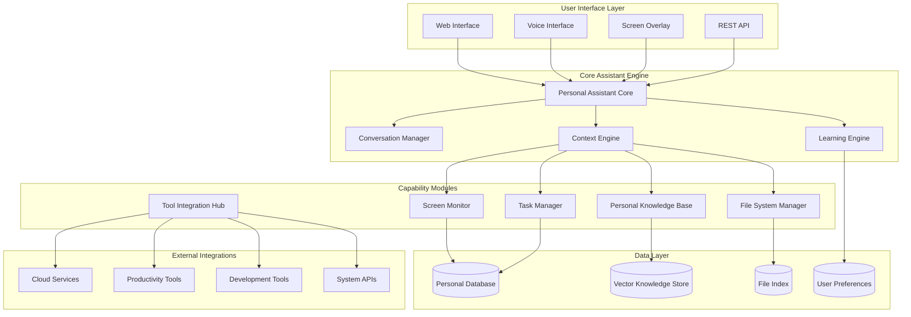

# Personal Assistant Enhancement - Design Document

## Overview

This design document outlines the architecture and implementation approach for transforming the existing Self-Improving AI Assistant into a comprehensive personal assistant. The enhancement will add file system access, personalized learning, screen monitoring, and proactive assistance capabilities while maintaining the existing code improvement and conversation features.

## Architecture

### High-Level Architecture



## Components and Interfaces

### 1. Personal Assistant Core

**Purpose:** Central orchestrator that coordinates all personal assistant capabilities

**Key Responsibilities:**
- Route requests to appropriate capability modules
- Maintain user context and session state
- Coordinate multi-modal interactions
- Enforce privacy and security policies

**Interface:**
```python
class PersonalAssistantCore:
    async def process_request(self, request: AssistantRequest) -> AssistantResponse
    async def get_context(self, user_id: str) -> UserContext
    async def learn_from_interaction(self, interaction: Interaction) -> None
    async def suggest_proactive_actions(self, context: UserContext) -> List[Suggestion]
```

### 2. File System Manager

**Purpose:** Secure file system access and management with user permission controls

**Key Responsibilities:**
- File reading, writing, and organization
- Content analysis and indexing
- Permission management and security
- File format support (text, PDF, images, documents)

**Interface:**
```python
class FileSystemManager:
    async def read_file(self, path: str, user_id: str) -> FileContent
    async def write_file(self, path: str, content: str, user_id: str) -> bool
    async def search_files(self, query: str, user_id: str) -> List[FileMatch]
    async def analyze_file_content(self, path: str) -> FileAnalysis
    async def organize_files(self, directory: str, strategy: str) -> OrganizationPlan
```

### 3. Screen Monitor

**Purpose:** Capture and analyze screen content for contextual awareness

**Key Responsibilities:**
- Screen capture with privacy controls
- OCR and content extraction
- Application context detection
- Real-time context updates

**Interface:**
```python
class ScreenMonitor:
    async def start_monitoring(self, user_id: str, config: MonitorConfig) -> bool
    async def stop_monitoring(self, user_id: str) -> bool
    async def get_current_context(self, user_id: str) -> ScreenContext
    async def analyze_screen_content(self, screenshot: bytes) -> ScreenAnalysis
```

### 4. Learning Engine

**Purpose:** Personalized learning from user interactions and preferences

**Key Responsibilities:**
- Pattern recognition in user behavior
- Preference learning and adaptation
- Feedback processing and improvement
- Personalization model updates

**Interface:**
```python
class LearningEngine:
    async def learn_from_interaction(self, interaction: Interaction) -> None
    async def update_user_model(self, user_id: str, feedback: Feedback) -> None
    async def get_personalized_suggestions(self, context: UserContext) -> List[Suggestion]
    async def adapt_to_feedback(self, feedback: UserFeedback) -> None
```

### 5. Personal Knowledge Base

**Purpose:** Build and maintain personalized knowledge from user's documents and interactions

**Key Responsibilities:**
- Document indexing and knowledge extraction
- Semantic search and retrieval
- Knowledge graph construction
- Context-aware information retrieval

**Interface:**
```python
class PersonalKnowledgeBase:
    async def index_document(self, document: Document, user_id: str) -> None
    async def search_knowledge(self, query: str, user_id: str) -> List[KnowledgeItem]
    async def extract_entities(self, text: str) -> List[Entity]
    async def build_knowledge_graph(self, user_id: str) -> KnowledgeGraph
```

### 6. Task Manager

**Purpose:** Intelligent task and project management with proactive assistance

**Key Responsibilities:**
- Task tracking and deadline management
- Project context maintenance
- Proactive reminders and suggestions
- Productivity analytics

**Interface:**
```python
class TaskManager:
    async def create_task(self, task: Task, user_id: str) -> str
    async def update_task_progress(self, task_id: str, progress: float) -> None
    async def get_upcoming_deadlines(self, user_id: str) -> List[Deadline]
    async def suggest_task_prioritization(self, user_id: str) -> List[TaskPriority]
```

## Data Models

### User Context Model
```python
@dataclass
class UserContext:
    user_id: str
    current_activity: str
    active_applications: List[str]
    current_files: List[str]
    recent_interactions: List[Interaction]
    preferences: UserPreferences
    knowledge_state: KnowledgeState
    task_context: TaskContext
```

### File Content Model
```python
@dataclass
class FileContent:
    path: str
    content: str
    file_type: str
    metadata: Dict[str, Any]
    extracted_entities: List[Entity]
    summary: str
    last_modified: datetime
```

### Screen Context Model
```python
@dataclass
class ScreenContext:
    active_application: str
    window_title: str
    visible_text: str
    ui_elements: List[UIElement]
    detected_actions: List[str]
    context_summary: str
    timestamp: datetime
```

### Learning Model
```python
@dataclass
class UserModel:
    user_id: str
    preferences: Dict[str, Any]
    behavior_patterns: List[Pattern]
    skill_levels: Dict[str, float]
    interaction_history: List[Interaction]
    feedback_history: List[Feedback]
    adaptation_weights: Dict[str, float]
```

## Error Handling

### Privacy and Security Errors
- **File Access Denied:** Clear explanation of permission requirements
- **Screen Monitoring Blocked:** Guidance on enabling monitoring safely
- **Data Privacy Violation:** Immediate halt and user notification

### System Integration Errors
- **Application Integration Failed:** Fallback to manual assistance
- **Cloud Service Unavailable:** Local alternatives and retry mechanisms
- **File System Error:** Safe error handling with data protection

### Learning and Adaptation Errors
- **Model Update Failed:** Graceful degradation with previous model
- **Feedback Processing Error:** Manual review and correction options
- **Context Understanding Error:** Request for clarification from user

## Testing Strategy

### Unit Testing
- Individual component functionality
- Data model validation
- Security control verification
- Privacy compliance testing

### Integration Testing
- Cross-component communication
- External service integration
- File system access patterns
- Screen monitoring accuracy

### User Experience Testing
- Multi-modal interaction flows
- Personalization effectiveness
- Proactive assistance relevance
- Privacy control usability

### Security Testing
- File access permission enforcement
- Data encryption and storage
- Screen capture security
- User consent validation

### Performance Testing
- Real-time screen monitoring
- Large file processing
- Knowledge base search speed
- Learning model update performance

## Privacy and Security Design

### Data Protection
- **Encryption at Rest:** All personal data encrypted with user-specific keys
- **Encryption in Transit:** TLS for all network communications
- **Access Controls:** Role-based access with user permission granularity
- **Data Minimization:** Only collect and store necessary data

### User Consent Management
- **Granular Permissions:** Separate controls for each capability
- **Consent Tracking:** Audit trail of all permission grants and revocations
- **Easy Revocation:** Simple interface to withdraw permissions
- **Transparency:** Clear explanation of data usage

### Screen Monitoring Security
- **Selective Monitoring:** User control over which applications to monitor
- **Content Filtering:** Automatic exclusion of sensitive content (passwords, etc.)
- **Local Processing:** Screen analysis performed locally when possible
- **Secure Storage:** Encrypted storage of screen context data

## Deployment Architecture

### Local Deployment
- **Desktop Application:** Electron-based app for full system integration
- **System Service:** Background service for continuous monitoring
- **Local Database:** SQLite for personal data storage
- **Local Vector Store:** FAISS for knowledge base search

### Hybrid Deployment
- **Local Processing:** Sensitive operations performed locally
- **Cloud Enhancement:** Optional cloud services for advanced features
- **Sync Capabilities:** Secure synchronization across devices
- **Offline Mode:** Full functionality without internet connection

### Security Infrastructure
- **Certificate Management:** Local certificate authority for secure communications
- **Key Management:** Hardware security module integration where available
- **Audit Logging:** Comprehensive logging of all system access
- **Backup and Recovery:** Encrypted backup with user control

## Integration Points

### Operating System Integration
- **File System APIs:** Native file system access with proper permissions
- **Screen Capture APIs:** Platform-specific screen capture capabilities
- **System Notifications:** Native notification system integration
- **Accessibility APIs:** Integration with system accessibility features

### Application Integration
- **Browser Extensions:** Web browser integration for context awareness
- **Office Suite Plugins:** Integration with Microsoft Office, Google Workspace
- **Development Tools:** IDE plugins and terminal integration
- **Communication Tools:** Email and messaging platform integration

### Cloud Service Integration
- **Storage Services:** Google Drive, OneDrive, Dropbox integration
- **Productivity Suites:** Calendar, task management, note-taking apps
- **Development Platforms:** GitHub, GitLab, cloud development environments
- **AI Services:** Optional integration with external AI capabilities

## Scalability Considerations

### Performance Optimization
- **Lazy Loading:** Load components and data on demand
- **Caching Strategy:** Multi-level caching for frequently accessed data
- **Background Processing:** Asynchronous processing for non-critical tasks
- **Resource Management:** Intelligent resource allocation and cleanup

### Data Management
- **Incremental Indexing:** Update knowledge base incrementally
- **Data Archiving:** Automatic archiving of old data with user control
- **Storage Optimization:** Compression and deduplication of stored data
- **Query Optimization:** Efficient search and retrieval algorithms

### User Experience Scaling
- **Progressive Enhancement:** Core features work without advanced capabilities
- **Adaptive Interface:** UI adapts to user expertise and preferences
- **Customization Options:** Extensive customization without complexity
- **Performance Monitoring:** Real-time performance feedback and optimization