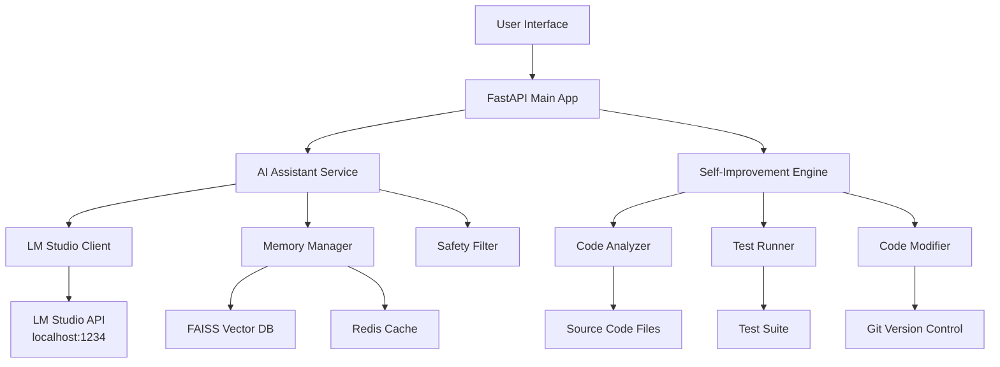

# Design Document

## Overview

The Self-Improving AI Assistant extends the existing orchestrator architecture to provide a conversational AI interface powered by OpenAI/GPT-OSS-20B via LM Studio, with autonomous self-improvement capabilities. The system builds upon the current FastAPI, Redis, and vector memory infrastructure while adding new components for code analysis, testing, and safe self-modification.

## Architecture

### High-Level Architecture



### Component Integration

The design integrates with existing components:
- **LLMAdapter**: Extended to support LM Studio configuration for GPT-OSS-20B
- **MemoryManager**: Enhanced for conversation context management
- **SafetyFilter**: Applied to both user interactions and self-generated code
- **AgentRegistry**: New agent type for self-improvement tasks

## Components and Interfaces

### 1. AI Assistant Service

**Purpose**: Main conversational interface with context management

**Key Classes**:
- `AIAssistantService`: Core service for handling user conversations
- `ConversationManager`: Manages session state and context
- `LMStudioAdapter`: Specialized adapter for LM Studio integration

**Interfaces**:
```python
class AIAssistantService:
    async def process_query(self, query: str, session_id: str) -> str
    async def get_conversation_history(self, session_id: str) -> List[Message]
    async def clear_session(self, session_id: str) -> bool

class ConversationManager:
    def add_message(self, session_id: str, message: Message) -> None
    def get_context(self, session_id: str, max_tokens: int) -> str
    def summarize_old_context(self, session_id: str) -> str
```

### 2. Self-Improvement Engine

**Purpose**: Autonomous code analysis, testing, and improvement

**Key Classes**:
- `SelfImprovementEngine`: Orchestrates the improvement process
- `CodeAnalyzer`: Analyzes code for performance and optimization opportunities
- `TestRunner`: Executes tests and validates improvements
- `CodeModifier`: Safely applies code changes with rollback capability

**Interfaces**:
```python
class SelfImprovementEngine:
    async def analyze_system_performance(self) -> PerformanceReport
    async def identify_improvements(self) -> List[Improvement]
    async def validate_improvement(self, improvement: Improvement) -> ValidationResult
    async def apply_improvement(self, improvement: Improvement) -> bool

class CodeAnalyzer:
    def analyze_response_times(self) -> Dict[str, float]
    def analyze_memory_usage(self) -> MemoryReport
    def scan_code_quality(self) -> List[CodeIssue]
    def suggest_optimizations(self) -> List[Optimization]
```

### 3. LM Studio Integration

**Purpose**: Enhanced integration with LM Studio for GPT-OSS-20B

**Configuration**:
```python
class LMStudioConfig:
    endpoint_url: str = "http://localhost:1234"
    model_name: str = "gpt-oss-20b"
    temperature: float = 0.7
    max_tokens: int = 2048
    timeout: int = 30
    retry_attempts: int = 3
```

**Enhanced Client**:
- Connection health monitoring
- Automatic retry logic
- Model parameter optimization
- Response streaming support

## Data Models

### Conversation Models

```python
class Message:
    id: str
    session_id: str
    role: Literal["user", "assistant", "system"]
    content: str
    timestamp: datetime
    metadata: Dict[str, Any]

class ConversationSession:
    id: str
    user_id: str
    created_at: datetime
    last_activity: datetime
    messages: List[Message]
    context_summary: str
```

### Self-Improvement Models

```python
class PerformanceMetric:
    name: str
    value: float
    unit: str
    timestamp: datetime
    threshold: float

class Improvement:
    id: str
    type: Literal["performance", "code_quality", "feature"]
    description: str
    affected_files: List[str]
    proposed_changes: Dict[str, str]
    expected_benefit: str
    risk_level: Literal["low", "medium", "high"]

class ValidationResult:
    improvement_id: str
    tests_passed: bool
    performance_delta: Dict[str, float]
    errors: List[str]
    rollback_required: bool
```

## Error Handling

### LM Studio Connection Errors
- **Connection Timeout**: Retry with exponential backoff, fallback to cached responses
- **Model Not Available**: Log error, return graceful degradation message
- **Rate Limiting**: Queue requests, implement request throttling

### Self-Improvement Errors
- **Test Failures**: Automatic rollback, detailed error logging
- **Code Compilation Errors**: Revert changes, analyze failure patterns
- **Performance Regression**: Immediate rollback, blacklist problematic changes

### Safety Mechanisms
- **Code Change Validation**: All changes must pass safety checks
- **Rollback Points**: Automatic Git commits before any modifications
- **Emergency Stop**: Manual override to halt self-improvement processes

## Testing Strategy

### Unit Testing
- **Service Layer**: Mock LM Studio responses, test conversation logic
- **Self-Improvement**: Mock file system operations, test analysis algorithms
- **Integration**: Test LM Studio connectivity, Redis operations

### Integration Testing
- **End-to-End Conversations**: Full conversation flows with real LM Studio
- **Self-Improvement Cycles**: Complete improvement cycles in isolated environment
- **Performance Testing**: Load testing with concurrent conversations

### Safety Testing
- **Malicious Input**: Test safety filters with adversarial prompts
- **Code Injection**: Validate self-improvement against malicious code generation
- **Rollback Testing**: Verify rollback mechanisms under various failure scenarios

### Continuous Testing
- **Automated Test Suite**: Run before any self-improvements
- **Performance Benchmarks**: Track system performance over time
- **Safety Audits**: Regular validation of safety mechanisms

## Implementation Phases

### Phase 1: Basic AI Assistant
- LM Studio integration with GPT-OSS-20B
- Conversation management with context
- Basic safety filtering

### Phase 2: Enhanced Context Management
- Vector-based conversation retrieval
- Context summarization
- Session persistence

### Phase 3: Self-Analysis Foundation
- Performance monitoring
- Code quality analysis
- Improvement identification

### Phase 4: Safe Self-Improvement
- Automated testing framework
- Code modification with rollback
- Continuous improvement loop

## Security Considerations

- **Input Validation**: All user inputs sanitized before LM Studio
- **Code Execution Sandboxing**: Self-improvements tested in isolated environment
- **Access Control**: Self-improvement features require admin privileges
- **Audit Logging**: All self-modifications logged with full traceability
- **Emergency Procedures**: Manual override capabilities for all autonomous functions