# Architecture Overview - Personal Assistant Enhancement

## System Architecture

The Personal Assistant Enhancement follows a modular, layered architecture designed for scalability, security, and maintainability.

```mermaid
graph TB
    subgraph "User Interface Layer"
        WebUI[Web Interface]
        VoiceUI[Voice Interface 🔄]
        ScreenOverlay[Screen Overlay 🔄]
        API[REST API]
    end
    
    subgraph "Core Assistant Engine"
        PACore[Personal Assistant Core ✅]
        ConversationManager[Conversation Manager]
        ContextEngine[Context Engine]
        LearningEngine[Learning Engine ✅]
    end
    
    subgraph "Capability Modules"
        FileManager[File System Manager ✅]
        ScreenMonitor[Screen Monitor ✅]
        TaskManager[Task Manager ✅]
        KnowledgeBase[Personal Knowledge Base ✅]
        IntegrationHub[Tool Integration Hub ⏳]
        ProactiveAssistant[Proactive Assistant ⏳]
    end
    
    subgraph "Security & Privacy Layer"
        PrivacyManager[Privacy Manager ⏳]
        SecurityControls[Security Controls ⏳]
        PermissionManager[Permission Manager ⏳]
    end
    
    subgraph "Data Layer"
        PersonalDB[(Personal Database)]
        VectorStore[(Vector Knowledge Store ✅)]
        FileIndex[(File Index ✅)]
        UserPrefs[(User Preferences ✅)]
        ContextCache[(Context Cache)]
    end
    
    subgraph "External Integrations"
        CloudServices[Cloud Services ⏳]
        ProductivityTools[Productivity Tools ⏳]
        DevTools[Development Tools ⏳]
        SystemAPIs[System APIs ✅]
    end
    
    WebUI --> PACore
    VoiceUI --> PACore
    ScreenOverlay --> PACore
    API --> PACore
    
    PACore --> ConversationManager
    PACore --> ContextEngine
    PACore --> LearningEngine
    
    ContextEngine --> FileManager
    ContextEngine --> ScreenMonitor
    ContextEngine --> TaskManager
    ContextEngine --> KnowledgeBase
    ContextEngine --> IntegrationHub
    ContextEngine --> ProactiveAssistant
    
    PACore --> PrivacyManager
    PrivacyManager --> SecurityControls
    PrivacyManager --> PermissionManager
    
    FileManager --> FileIndex
    ScreenMonitor --> ContextCache
    TaskManager --> PersonalDB
    KnowledgeBase --> VectorStore
    LearningEngine --> UserPrefs
    
    IntegrationHub --> CloudServices
    IntegrationHub --> ProductivityTools
    IntegrationHub --> DevTools
    IntegrationHub --> SystemAPIs
```

## Component Status Legend
- ✅ Complete and tested
- 🔄 In progress
- ⏳ Planned
- ❌ Not started

## Layer Descriptions

### User Interface Layer
**Purpose**: Provide multiple interaction modalities for users
**Status**: Partially complete (API ✅, Web UI ✅, Voice/Overlay 🔄)

- **Web Interface**: FastAPI-based web interface for configuration and interaction
- **Voice Interface**: Speech recognition and synthesis for hands-free interaction
- **Screen Overlay**: Visual annotations and contextual information display
- **REST API**: Programmatic access to all assistant capabilities

### Core Assistant Engine
**Purpose**: Central orchestration and intelligence
**Status**: Core complete, enhancements in progress

- **[[component-maps/personal-assistant-core|Personal Assistant Core]]**: Main orchestrator and request router
- **Conversation Manager**: Maintains conversation context and history
- **Context Engine**: Aggregates context from all capability modules
- **[[component-maps/learning-engine|Learning Engine]]**: Personalized learning and adaptation

### Capability Modules
**Purpose**: Specialized functionality modules
**Status**: Core modules complete, integrations planned

- **[[component-maps/file-system-manager|File System Manager]]**: Secure file operations and content analysis
- **[[component-maps/screen-monitor|Screen Monitor]]**: Screen capture and context extraction
- **[[component-maps/task-manager|Task Manager]]**: Task tracking and project management
- **[[component-maps/personal-knowledge-base|Personal Knowledge Base]]**: Document indexing and semantic search
- **Tool Integration Hub**: External tool and service integrations
- **Proactive Assistant**: Automation suggestions and proactive help

### Security & Privacy Layer
**Purpose**: Comprehensive privacy and security controls
**Status**: Basic implementation, enhancements planned

- **Privacy Manager**: Granular privacy controls and data management
- **Security Controls**: Encryption, access controls, and audit logging
- **Permission Manager**: User consent and permission management

### Data Layer
**Purpose**: Persistent storage and caching
**Status**: Core storage implemented, optimization ongoing

- **Personal Database**: User data, preferences, and interaction history
- **Vector Knowledge Store**: Semantic search and knowledge retrieval
- **File Index**: File metadata and content indexing
- **User Preferences**: Personalization settings and learned preferences
- **Context Cache**: Real-time context and temporary data

### External Integrations
**Purpose**: Connect with external tools and services
**Status**: System APIs implemented, others planned

- **Cloud Services**: Google Drive, OneDrive, Dropbox integration
- **Productivity Tools**: Calendar, email, note-taking applications
- **Development Tools**: IDEs, version control, terminal integration
- **System APIs**: Operating system and hardware integration

## Data Flow Architecture

## Security Architecture

### Privacy-First Design
- **Data Minimization**: Only collect necessary data
- **User Control**: Granular permissions and data management
- **Local Processing**: Sensitive operations performed locally
- **Encryption**: End-to-end encryption for sensitive data

### Access Control Matrix
| Component | File Access | Screen Access | Network Access | User Data |
|-----------|-------------|---------------|----------------|-----------|
| File Manager | ✅ Controlled | ❌ No | ❌ No | ✅ Metadata |
| Screen Monitor | ❌ No | ✅ Controlled | ❌ No | ✅ Context |
| Knowledge Base | ✅ Read-only | ❌ No | ❌ No | ✅ Indexed |
| Integration Hub | ❌ No | ❌ No | ✅ Controlled | ✅ Tokens |

## Performance Architecture

### Scalability Patterns
- **Lazy Loading**: Components loaded on demand
- **Caching Strategy**: Multi-level caching for performance
- **Async Processing**: Non-blocking operations for responsiveness
- **Resource Management**: Intelligent resource allocation

### Performance Metrics
- **Response Time**: < 200ms for simple queries
- **File Processing**: < 5s for large documents
- **Screen Analysis**: < 1s for context extraction
- **Knowledge Search**: < 100ms for semantic queries

## Deployment Architecture

### Local Deployment

### Container Architecture
- **Base Image**: Python 3.11 with ML libraries
- **GPU Support**: CUDA-enabled for AI processing
- **Volume Mounts**: User data and configuration
- **Network**: Isolated network for security

## Integration Patterns

### Plugin Architecture
- **Interface-Based**: Standardized plugin interfaces
- **Dynamic Loading**: Runtime plugin discovery and loading
- **Sandboxing**: Isolated execution for third-party plugins
- **API Gateway**: Unified API access for all plugins

### Event-Driven Architecture
- **Event Bus**: Central event distribution
- **Async Handlers**: Non-blocking event processing
- **Event Sourcing**: Complete interaction history
- **CQRS**: Separate read/write models for optimization

## Related Documentation

### Core Project Information
- [[project-overview]] - High-level project status and vision
- [[requirements-map]] - Requirements tracking and completion status
- [[task-progress]] - Implementation progress and current milestones
- [[educational-assessment]] - Educational value and university applications

### Detailed Architecture Analysis
- [[team-onboarding/architecture-deep-dive]] - Comprehensive architectural analysis
- [[team-onboarding/technical-concepts]] - Core patterns and implementation concepts
- [[team-onboarding/project-overview-complete]] - Complete system overview

### Component Documentation
- [[component-maps/personal-assistant-core]] - Core orchestrator architecture
- [[component-maps/multi-modal-interaction]] - Multi-modal interaction system

### Implementation Guides
- [[team-onboarding/development-guide]] - Development workflow and practices
- [[team-onboarding/README]] - Complete onboarding and learning paths
- [[daily-logs/2025-08-17]] - Latest implementation details and decisions

### Specialized Topics
- [[team-onboarding/technical-concepts#Security & Privacy Patterns]] - Security architecture
- [[team-onboarding/technical-concepts#Performance Patterns]] - Performance optimization
- [[team-onboarding/architecture-deep-dive#Privacy & Security Architecture]] - Privacy-first design
- [[team-onboarding/architecture-deep-dive#Performance Architecture]] - Scalability patterns

### Navigation
- [[README]] - Main knowledge base navigation
- [[README#Technical Documentation]] - Technical documentation index
- [[team-onboarding/README#System Architecture Overview]] - Architecture diagram