# Component Maps - Technical Documentation Index

## 🧩 Component Documentation Overview

This directory contains detailed technical documentation for all major system components. Each component map provides comprehensive information about architecture, implementation, testing, and integration.

## 📋 Available Component Maps

### ✅ **Completed Components**

#### [[personal-assistant-core]] - Central Orchestrator
**Status**: Complete and fully integrated
**Purpose**: Central request routing, context management, and capability coordination
**Key Features**:
- Request-response processing for 15+ request types
- Multi-modal interaction coordination
- Privacy and security enforcement
- Context preservation and learning integration
- Capability module lifecycle management

**Related Documentation**:
- [[../team-onboarding/technical-concepts#Request-Response Pattern]] - Core patterns
- [[../team-onboarding/architecture-deep-dive#Request Processing Architecture]] - Detailed flow
- [[../task-progress#Task 6]] - Integration implementation

#### [[multi-modal-interaction]] - Multi-Modal Interface System
**Status**: Complete with comprehensive testing
**Purpose**: Voice, visual, and accessibility interaction capabilities
**Key Features**:
- Voice command processing with speech recognition
- Screen overlay system for visual feedback
- Intelligent text completion with context awareness
- Accessibility manager with WCAG 2.1 AA compliance
- Seamless interaction mode switching

**Related Documentation**:
- [[../requirements-map#Requirement 6]] - Multi-modal requirements
- [[../team-onboarding/technical-concepts#Multi-Modal Coordination Pattern]] - Implementation patterns
- [[../task-progress#Task 7]] - Implementation details

### 🔄 **Planned Component Maps**

#### File System Manager
**Status**: Implementation complete, documentation pending
**Purpose**: Secure file operations with privacy controls
**Features**: File read/write, content analysis, organization, security controls

#### Screen Monitor  
**Status**: Implementation complete, documentation pending
**Purpose**: Screen capture and context analysis
**Features**: OCR, application detection, privacy-controlled monitoring

#### Learning Engine
**Status**: Implementation complete, documentation pending  
**Purpose**: Personalized learning and behavior adaptation
**Features**: Pattern recognition, preference learning, feedback processing

#### Task Manager
**Status**: Implementation complete, documentation pending
**Purpose**: Intelligent task and project management
**Features**: Task tracking, deadline management, productivity analytics

#### Personal Knowledge Base
**Status**: Implementation complete, documentation pending
**Purpose**: Vector-based knowledge storage and retrieval
**Features**: Document indexing, semantic search, knowledge extraction

## 🏗️ Component Architecture Overview

```mermaid
graph TB
    subgraph "Core Orchestration"
        PACore[Personal Assistant Core ✅]
        InteractionManager[Multi-Modal Interaction ✅]
    end
    
    subgraph "Capability Modules"
        FileManager[File System Manager 📝]
        ScreenMonitor[Screen Monitor 📝]
        TaskManager[Task Manager 📝]
        KnowledgeBase[Personal Knowledge Base 📝]
        LearningEngine[Learning Engine 📝]
    end
    
    subgraph "Future Components"
        IntegrationHub[Tool Integration Hub ⏳]
        ProactiveAssistant[Proactive Assistant ⏳]
        PrivacyManager[Enhanced Privacy Manager ⏳]
    end
    
    PACore --> InteractionManager
    PACore --> FileManager
    PACore --> ScreenMonitor
    PACore --> TaskManager
    PACore --> KnowledgeBase
    PACore --> LearningEngine
    
    InteractionManager --> FileManager
    InteractionManager --> ScreenMonitor
    InteractionManager --> TaskManager
    InteractionManager --> KnowledgeBase
```

**Legend**:
- ✅ Complete documentation
- 📝 Implementation complete, documentation pending
- ⏳ Planned for future implementation

## 📚 Documentation Standards

### Component Map Structure
Each component map follows a standardized structure:

1. **Overview & Status** - Current implementation status
2. **Architecture** - Component design and relationships
3. **Implementation Plan** - Development approach and milestones
4. **Technical Implementation** - Code examples and patterns
5. **Integration Points** - How it connects with other components
6. **Testing Coverage** - Test strategy and current status
7. **Performance Metrics** - Performance requirements and measurements
8. **Security & Privacy** - Security considerations and privacy controls
9. **Related Documentation** - Cross-references to other resources

### Cross-Reference Standards
- **Bidirectional linking**: All related components link to each other
- **Architecture references**: Links to architectural documentation
- **Implementation tracking**: Links to task progress and requirements
- **Educational resources**: Links to learning materials and guides

## 🔗 Related Documentation

### Architecture & Design
- [[../architecture-overview]] - System architecture overview
- [[../team-onboarding/architecture-deep-dive]] - Detailed architectural analysis
- [[../team-onboarding/technical-concepts]] - Implementation patterns and concepts

### Project Management
- [[../task-progress]] - Implementation progress and component status
- [[../requirements-map]] - Requirements tracking and component coverage
- [[../project-overview]] - High-level project status

### Team Resources
- [[../team-onboarding/README]] - Complete onboarding guide
- [[../team-onboarding/development-guide]] - Development workflow for components
- [[../team-onboarding/project-overview-complete]] - Comprehensive system overview

### Educational Resources
- [[../educational-assessment]] - Educational value for software engineering courses
- [[../daily-logs/2025-08-17]] - Latest component implementation achievements

### Navigation
- [[../README]] - Main knowledge base hub
- [[../README#Technical Documentation]] - Technical documentation index

## 🎯 Using Component Maps

### For Developers
1. **Start with [[personal-assistant-core]]** - Understand the central orchestrator
2. **Study [[multi-modal-interaction]]** - Learn the multi-modal system
3. **Reference architecture docs** - Understand how components fit together
4. **Follow implementation patterns** - Use established patterns for new components

### For Architects
1. **Review component relationships** - Understand system integration
2. **Study security patterns** - Learn privacy and security implementations
3. **Analyze performance considerations** - Understand scalability approaches
4. **Plan future components** - Use existing patterns for new capabilities

### For Students
1. **Follow learning paths** - Use [[../team-onboarding/README]] for structured learning
2. **Study real implementations** - Learn from working code examples
3. **Understand design decisions** - Learn architectural reasoning
4. **Practice with examples** - Use component patterns in projects

## 📈 Component Development Pipeline

### Documentation Lifecycle
1. **Implementation Complete** - Component functionality finished
2. **Testing Verified** - Comprehensive test coverage achieved
3. **Documentation Created** - Component map written and reviewed
4. **Cross-References Added** - Links to/from related documentation
5. **Educational Integration** - Added to learning paths and guides

### Quality Standards
- **Technical Accuracy**: All code examples tested and verified
- **Comprehensive Coverage**: All major features and patterns documented
- **Clear Examples**: Practical code samples with explanations
- **Cross-Referenced**: Bidirectional links to related components
- **Educational Value**: Suitable for learning and reference

## 🚀 Contributing to Component Maps

### Creating New Component Maps
1. Follow the standardized structure outlined above
2. Include comprehensive code examples and patterns
3. Add bidirectional cross-references to related components
4. Update this index with the new component
5. Add references in related documentation

### Updating Existing Maps
1. Keep implementation details current with code changes
2. Update cross-references when new related documentation is added
3. Enhance examples and explanations based on user feedback
4. Maintain consistency with documentation standards

---

*This component documentation represents the technical heart of the Personal Assistant Enhancement project. Each map provides the detailed information needed to understand, maintain, and extend the system effectively.*