# Multi-Modal Interaction - Component Map

## Overview
The Multi-Modal Interaction system provides voice, visual, and text-based interaction capabilities, allowing users to interact with the personal assistant through the most convenient method for each situation.

## Status
- **Implementation**: ✅ Complete (Task 7)
- **Requirements**: 6.1-6.6 (100% fulfilled)
- **Testing**: ✅ 19 comprehensive tests passing
- **Integration**: ✅ Fully integrated with [[personal-assistant-core]]

## Architecture

```mermaid
graph TB
    subgraph "Multi-Modal Interface"
        VoiceProcessor[Voice Processor ✅]
        ScreenOverlay[Screen Overlay ✅]
        TextCompletion[Text Completion ✅]
        AccessibilityManager[Accessibility Manager ✅]
        ModeManager[Interaction Mode Manager ✅]
    end
    
    subgraph "Voice Processing"
        STT[Speech-to-Text]
        TTS[Text-to-Speech]
        VoiceCommands[Voice Command Parser]
        NoiseFilter[Noise Filtering]
    end
    
    subgraph "Visual Interface"
        OverlayRenderer[Overlay Renderer]
        AnnotationEngine[Annotation Engine]
        ContextDisplay[Context Display]
        VisualFeedback[Visual Feedback]
    end
    
    subgraph "Text Enhancement"
        CompletionEngine[Completion Engine]
        SuggestionProvider[Suggestion Provider]
        ContextAnalyzer[Context Analyzer]
        PatternLearner[Pattern Learner]
    end
    
    subgraph "Accessibility"
        ScreenReader[Screen Reader Support]
        KeyboardNav[Keyboard Navigation]
        HighContrast[High Contrast Mode]
        VoiceControl[Voice Control Alt]
    end
    
    VoiceProcessor --> STT
    VoiceProcessor --> TTS
    VoiceProcessor --> VoiceCommands
    VoiceProcessor --> NoiseFilter
    
    ScreenOverlay --> OverlayRenderer
    ScreenOverlay --> AnnotationEngine
    ScreenOverlay --> ContextDisplay
    ScreenOverlay --> VisualFeedback
    
    TextCompletion --> CompletionEngine
    TextCompletion --> SuggestionProvider
    TextCompletion --> ContextAnalyzer
    TextCompletion --> PatternLearner
    
    AccessibilityManager --> ScreenReader
    AccessibilityManager --> KeyboardNav
    AccessibilityManager --> HighContrast
    AccessibilityManager --> VoiceControl
    
    ModeManager --> VoiceProcessor
    ModeManager --> ScreenOverlay
    ModeManager --> TextCompletion
    ModeManager --> AccessibilityManager
```



## Implementation Plan (Task 7)

### 1. Voice Command Processing 🔄
**Requirement**: 6.1 - Voice command and response support

**Components to Implement**:
- `VoiceProcessor` class for speech recognition and synthesis
- `VoiceCommandParser` for natural language command interpretation
- `NoiseFilter` for audio quality improvement
- Integration with [[personal-assistant-core]]

**Key Features**:
- Real-time speech recognition
- Natural language command parsing
- Context-aware voice responses
- Noise filtering and accuracy improvement
- Wake word detection
- Voice activity detection

### 2. Screen Overlay and Annotation System 🔄
**Requirement**: 6.2 - Visual feedback through screen overlays

**Components to Implement**:
- `ScreenOverlay` class for overlay management
- `AnnotationEngine` for contextual annotations
- `ContextDisplay` for information presentation
- `VisualFeedback` for action confirmations

**Key Features**:
- Contextual information overlays
- Interactive annotations
- Visual action confirmations
- Application-specific overlays
- Non-intrusive display modes
- Customizable overlay styles

### 3. Intelligent Text Completion 🔄
**Requirement**: 6.3 - Text completion and suggestions

**Components to Implement**:
- `TextCompletion` class for completion logic
- `CompletionEngine` for suggestion generation
- `SuggestionProvider` for context-aware suggestions
- `PatternLearner` for user pattern recognition

**Key Features**:
- Context-aware text completion
- Application-specific suggestions
- Learning from user patterns
- Multi-language support
- Performance optimization
- Privacy-respecting learning

### 4. Accessibility Support 🔄
**Requirement**: 6.5 - Accessibility features

**Components to Implement**:
- `AccessibilityManager` for accessibility coordination
- `ScreenReader` integration for visual impairments
- `KeyboardNav` for keyboard-only navigation
- `HighContrast` mode for visual accessibility

**Key Features**:
- Screen reader compatibility
- Keyboard navigation support
- High contrast visual modes
- Voice control alternatives
- Customizable accessibility settings
- WCAG compliance

### 5. Interaction Mode Switching 🔄
**Requirement**: 6.6 - Seamless context switching

**Components to Implement**:
- `ModeManager` for interaction mode coordination
- Context preservation across modes
- Seamless mode transitions
- User preference management

**Key Features**:
- Automatic mode detection
- Manual mode switching
- Context preservation
- Preference-based defaults
- Application-adaptive modes
- Smooth transitions

## Technical Implementation

### Voice Processing Implementation
```python
class VoiceProcessor:
    def __init__(self):
        self.speech_recognizer = SpeechRecognizer()
        self.text_to_speech = TextToSpeech()
        self.command_parser = VoiceCommandParser()
        self.noise_filter = NoiseFilter()
    
    async def process_voice_command(self, audio_data: bytes) -> VoiceCommand:
        # Filter noise and enhance audio quality
        filtered_audio = self.noise_filter.filter(audio_data)
        
        # Convert speech to text
        text = await self.speech_recognizer.recognize(filtered_audio)
        
        # Parse command and extract intent
        command = self.command_parser.parse(text)
        
        return command
    
    async def generate_voice_response(self, text: str, user_preferences: dict) -> bytes:
        # Generate speech with user-preferred voice settings
        audio_data = await self.text_to_speech.synthesize(
            text, 
            voice=user_preferences.get('voice_type', 'default'),
            speed=user_preferences.get('speech_speed', 1.0)
        )
        
        return audio_data
```

### Screen Overlay Implementation
```python
class ScreenOverlay:
    def __init__(self):
        self.overlay_renderer = OverlayRenderer()
        self.annotation_engine = AnnotationEngine()
        self.context_display = ContextDisplay()
    
    async def show_contextual_overlay(self, context: ScreenContext, info: dict):
        # Create overlay based on current screen context
        overlay_config = self.annotation_engine.create_annotations(context, info)
        
        # Render overlay with contextual information
        await self.overlay_renderer.render(overlay_config)
    
    async def show_visual_feedback(self, action: str, result: ActionResult):
        # Display visual confirmation of actions
        feedback_config = self.context_display.create_feedback(action, result)
        
        # Show temporary feedback overlay
        await self.overlay_renderer.show_temporary(feedback_config, duration=3.0)
```

### Text Completion Implementation
```python
class TextCompletion:
    def __init__(self):
        self.completion_engine = CompletionEngine()
        self.suggestion_provider = SuggestionProvider()
        self.pattern_learner = PatternLearner()
    
    async def get_completions(self, context: TextContext) -> List[Completion]:
        # Analyze current text context
        analysis = await self.completion_engine.analyze_context(context)
        
        # Generate context-aware suggestions
        suggestions = await self.suggestion_provider.get_suggestions(analysis)
        
        # Learn from user patterns
        await self.pattern_learner.update_patterns(context, suggestions)
        
        return suggestions
    
    async def learn_from_selection(self, context: TextContext, selected: Completion):
        # Update learning model based on user selection
        await self.pattern_learner.learn_selection(context, selected)
```

## Integration with Personal Assistant Core

### Request Routing Enhancement
```python
# Enhanced request processing in PersonalAssistantCore
async def process_request(self, request: AssistantRequest) -> AssistantResponse:
    # Determine interaction mode
    mode = self.mode_manager.detect_mode(request)
    
    # Process based on interaction mode
    if mode == InteractionMode.VOICE:
        return await self.process_voice_request(request)
    elif mode == InteractionMode.VISUAL:
        return await self.process_visual_request(request)
    elif mode == InteractionMode.TEXT:
        return await self.process_text_request(request)
    else:
        return await self.process_mixed_mode_request(request)
```

### Context Preservation
```python
# Context management across interaction modes
class InteractionContext:
    def __init__(self):
        self.current_mode = InteractionMode.TEXT
        self.conversation_history = []
        self.user_preferences = {}
        self.active_tasks = []
    
    async def switch_mode(self, new_mode: InteractionMode):
        # Preserve context when switching modes
        await self.save_current_context()
        self.current_mode = new_mode
        await self.adapt_to_new_mode()
```

## Testing Strategy

### Unit Tests 🔄
- Voice command recognition accuracy
- Screen overlay rendering and positioning
- Text completion suggestion quality
- Accessibility feature compliance
- Mode switching functionality

### Integration Tests 🔄
- Multi-modal conversation flows
- Context preservation across modes
- Performance under different interaction patterns
- Accessibility compliance testing
- Cross-platform compatibility

### User Experience Tests 🔄
- Voice command response time
- Overlay visibility and usability
- Text completion helpfulness
- Accessibility user experience
- Mode switching smoothness

## Performance Requirements

### Voice Processing
- **Recognition Latency**: < 500ms
- **Response Generation**: < 200ms
- **Accuracy**: > 95% for clear speech
- **Noise Handling**: Functional in moderate noise

### Screen Overlay
- **Render Time**: < 100ms
- **Overlay Positioning**: Pixel-perfect accuracy
- **Resource Usage**: < 50MB additional memory
- **Refresh Rate**: 60fps for smooth animations

### Text Completion
- **Suggestion Speed**: < 50ms
- **Accuracy**: > 80% helpful suggestions
- **Learning Adaptation**: Real-time pattern updates
- **Memory Usage**: < 100MB for pattern storage

## Privacy and Security

### Voice Processing Privacy
- Local speech processing when possible
- Encrypted audio data transmission
- User control over voice data retention
- Clear consent for cloud-based processing

### Screen Overlay Security
- No sensitive information in overlays
- Secure overlay rendering
- User control over overlay content
- Privacy-aware context detection

### Text Completion Privacy
- Local pattern learning
- No keystroke logging
- User control over learning data
- Secure suggestion generation

## Accessibility Compliance

### WCAG 2.1 AA Compliance
- Screen reader compatibility
- Keyboard navigation support
- Color contrast requirements
- Text scaling support
- Focus management

### Platform Accessibility
- Windows Narrator support
- macOS VoiceOver integration
- Linux screen reader compatibility
- Mobile accessibility features

## Dependencies and Requirements

### System Dependencies
- **Speech Recognition**: SpeechRecognition library
- **Text-to-Speech**: pyttsx3 or cloud TTS services
- **Screen Overlay**: tkinter or PyQt for overlays
- **Accessibility**: Platform-specific accessibility APIs

### Hardware Requirements
- **Microphone**: For voice input
- **Speakers/Headphones**: For voice output
- **Display**: For visual overlays
- **Keyboard**: For text completion

## Related Components & Documentation

### Core Integration
- [[personal-assistant-core]] - Core integration point and orchestrator
- **Screen Monitor** - Screen context for overlays (✅ Complete)
- **Learning Engine** - Pattern learning for text completion (✅ Complete)
- **Task Manager** - Task context for suggestions (✅ Complete)

### Architecture & Design
- [[../architecture-overview]] - System architecture and multi-modal integration
- [[../team-onboarding/architecture-deep-dive]] - Detailed architectural analysis
- [[../team-onboarding/technical-concepts]] - Multi-modal implementation patterns

### Implementation Details
- [[../task-progress#Task 7]] - Multi-modal implementation progress
- [[../requirements-map#Requirement 6]] - Multi-modal interaction requirements
- [[../daily-logs/2025-08-17]] - Implementation achievements and decisions

### Team Resources
- [[../team-onboarding/README]] - Complete onboarding with multi-modal concepts
- [[../team-onboarding/development-guide]] - Development practices for multi-modal features
- [[../team-onboarding/project-overview-complete]] - Multi-modal system overview

### Educational Resources
- [[../educational-assessment]] - Educational value for HCI and accessibility courses
- [[../team-onboarding/technical-concepts#Multi-Modal Coordination Pattern]] - Implementation patterns
- [[../team-onboarding/architecture-deep-dive#Multi-Modal Architecture Deep Dive]] - Detailed analysis

### Accessibility & Standards
- [[../team-onboarding/technical-concepts#Accessibility-First Design]] - Accessibility patterns
- [[../team-onboarding/architecture-deep-dive#Privacy & Security Architecture]] - Privacy considerations
- [[../requirements-map#Requirement 6]] - WCAG compliance requirements

### Navigation
- [[../README]] - Main knowledge base hub
- [[../project-overview]] - High-level project status with multi-modal achievements

## Future Enhancements
- **Gesture Recognition**: Hand gesture support → [[../task-progress#Future Tasks]]
- **Eye Tracking**: Gaze-based interaction → [[../team-onboarding/project-overview-complete#Future Enhancements]]
- **Brain-Computer Interface**: Advanced accessibility → [[../educational-assessment#Accessibility & Ethics]]
- **Augmented Reality**: AR overlay support → [[../architecture-overview#Integration Patterns]]
- **Multi-Language**: International language support → [[../requirements-map#Future Requirements]]