# Personal Assistant Core - Component Map

## Overview
The Personal Assistant Core is the central orchestrator that coordinates all personal assistant capabilities, manages user context, and provides the main interface for user interactions.

## Status
- **Implementation**: ✅ Complete (Task 6)
- **Testing**: ✅ Unit and integration tests passing
- **Current Enhancement**: 🔄 Multi-modal interaction support (Task 7)

## Architecture

```mermaid
graph TB
    subgraph "Personal Assistant Core"
        Router[Request Router]
        Context[Context Manager]
        Orchestrator[Capability Orchestrator]
        Response[Response Generator]
        Learning[Learning Coordinator]
    end
    
    subgraph "Capability Modules"
        FileManager[File System Manager]
        ScreenMonitor[Screen Monitor]
        TaskManager[Task Manager]
        KnowledgeBase[Knowledge Base]
        MultiModal[Multi-Modal Interface 🔄]
    end
    
    subgraph "Data & Context"
        UserContext[User Context]
        SessionState[Session State]
        Preferences[User Preferences]
    end
    
    Router --> Orchestrator
    Orchestrator --> FileManager
    Orchestrator --> ScreenMonitor
    Orchestrator --> TaskManager
    Orchestrator --> KnowledgeBase
    Orchestrator --> MultiModal
    
    Context --> UserContext
    Context --> SessionState
    Context --> Preferences
    
    Learning --> Preferences
    Response --> Context
```



## Key Components

### Request Router
**Purpose**: Route incoming requests to appropriate capability modules
**Status**: ✅ Complete

**Capabilities**:
- Intent classification and routing
- Request validation and sanitization
- Multi-modal request handling
- Error handling and fallback routing

### Context Manager
**Purpose**: Maintain and provide user context across interactions
**Status**: ✅ Complete

**Capabilities**:
- Session state management
- User preference tracking
- Interaction history maintenance
- Context aggregation from modules

### Capability Orchestrator
**Purpose**: Coordinate multiple capability modules for complex requests
**Status**: ✅ Complete

**Capabilities**:
- Module lifecycle management
- Cross-module communication
- Parallel capability execution
- Result aggregation and synthesis

### Response Generator
**Purpose**: Generate appropriate responses based on capability results
**Status**: ✅ Complete, 🔄 Multi-modal enhancements

**Capabilities**:
- Response formatting and personalization
- Multi-modal response generation
- Context-aware response adaptation
- Error response handling

### Learning Coordinator
**Purpose**: Coordinate learning across all capability modules
**Status**: ✅ Complete

**Capabilities**:
- Cross-module learning coordination
- Preference update propagation
- Feedback processing and distribution
- Learning model synchronization

## Implementation Details

### Core Class Structure
```python
class PersonalAssistantCore:
    def __init__(self):
        self.file_manager = FileSystemManager()
        self.screen_monitor = ScreenMonitor()
        self.task_manager = TaskManager()
        self.knowledge_base = PersonalKnowledgeBase()
        self.learning_engine = LearningEngine()
        # Multi-modal components (Task 7)
        self.voice_processor = VoiceProcessor()  # 🔄 In Progress
        self.screen_overlay = ScreenOverlay()   # 🔄 In Progress
        self.text_completion = TextCompletion() # 🔄 In Progress
    
    async def process_request(self, request: AssistantRequest) -> AssistantResponse
    async def get_context(self, user_id: str) -> UserContext
    async def learn_from_interaction(self, interaction: Interaction) -> None
    async def suggest_proactive_actions(self, context: UserContext) -> List[Suggestion]
```

### Request Processing Flow
1. **Request Reception**: Receive and validate incoming request
2. **Context Retrieval**: Get current user context and preferences
3. **Intent Classification**: Determine request type and required capabilities
4. **Capability Routing**: Route to appropriate capability modules
5. **Result Aggregation**: Combine results from multiple modules
6. **Response Generation**: Create personalized, context-aware response
7. **Learning Update**: Update user model based on interaction
8. **Response Delivery**: Send response via appropriate channel

## Integration Points

### Capability Module Integration
- **[[file-system-manager]]**: File operations and content analysis
- **[[screen-monitor]]**: Screen context and visual information
- **[[task-manager]]**: Task tracking and project management
- **[[personal-knowledge-base]]**: Knowledge retrieval and search
- **[[learning-engine]]**: Personalization and adaptation

### Multi-Modal Integration (Task 7 - In Progress)
- **Voice Processing**: Speech-to-text and text-to-speech
- **Screen Overlay**: Visual annotations and contextual displays
- **Text Completion**: Intelligent text suggestions and completion
- **Accessibility**: Screen reader and keyboard navigation support

### External Integration Points
- **FastAPI Endpoints**: REST API for web and external access
- **WebSocket Connections**: Real-time communication
- **System APIs**: Operating system integration
- **Cloud Services**: External service integration (planned)

## Configuration and Settings

### User Preferences
```python
@dataclass
class UserPreferences:
    interaction_mode: str = "text"  # text, voice, mixed
    privacy_level: str = "standard"  # minimal, standard, full
    proactive_assistance: bool = True
    screen_monitoring: bool = False
    file_access_permissions: Dict[str, bool]
    learning_enabled: bool = True
    response_style: str = "conversational"
```

### Capability Configuration
```python
@dataclass
class CapabilityConfig:
    file_manager_enabled: bool = True
    screen_monitor_enabled: bool = False
    task_manager_enabled: bool = True
    knowledge_base_enabled: bool = True
    voice_interface_enabled: bool = False  # Task 7
    screen_overlay_enabled: bool = False   # Task 7
    text_completion_enabled: bool = False  # Task 7
```

## Performance Metrics

### Response Times (Current)
- Simple queries: ~150ms
- File operations: ~300ms
- Knowledge search: ~200ms
- Screen analysis: ~500ms
- Complex multi-module: ~800ms

### Resource Usage
- Memory: ~200MB baseline
- CPU: 5-15% during active processing
- Storage: ~50MB for user data
- Network: Minimal (local processing)

## Security and Privacy

### Access Controls
- User permission validation for all operations
- Capability-specific access controls
- Audit logging for sensitive operations
- Data encryption for stored preferences

### Privacy Features
- Granular capability enable/disable
- Data retention controls
- Interaction history management
- Secure context isolation

## Testing Coverage

### Unit Tests ✅
- Request routing and validation
- Context management operations
- Capability orchestration logic
- Response generation and formatting
- Learning coordination functions

### Integration Tests ✅
- End-to-end request processing
- Multi-capability coordination
- Context persistence and retrieval
- Error handling and recovery
- Performance and load testing

### Multi-Modal Tests 🔄 (Task 7)
- Voice command processing
- Screen overlay functionality
- Text completion accuracy
- Accessibility compliance
- Mode switching and context preservation

## Current Enhancements (Task 7)

### Voice Command Processing
- Speech recognition integration
- Natural language command parsing
- Voice response generation
- Noise filtering and accuracy improvement

### Screen Overlay System
- Contextual information display
- Interactive annotations
- Visual feedback for actions
- Accessibility-compliant overlays

### Text Completion
- Context-aware suggestions
- Multi-application support
- Learning from user patterns
- Performance optimization

### Accessibility Support
- Screen reader compatibility
- Keyboard navigation
- High contrast mode support
- Voice control alternatives

## Future Enhancements

### Planned Features (Tasks 8-11)
- **Tool Integration Hub**: External service connections
- **Proactive Assistant**: Automation and suggestions
- **Enhanced Privacy**: Granular controls and transparency
- **Continuous Learning**: Self-improvement capabilities

### Performance Optimizations
- Async processing improvements
- Caching strategy enhancements
- Resource usage optimization
- Response time reduction

## Related Components
- [[file-system-manager]] - File operations capability
- [[screen-monitor]] - Screen monitoring capability
- [[task-manager]] - Task management capability
- [[personal-knowledge-base]] - Knowledge retrieval capability
- [[learning-engine]] - Personalization engine
- [[multi-modal-interaction]] - Multi-modal interface (Task 7)

## Dependencies
- **FastAPI**: Web framework and API
- **Pydantic**: Data validation and settings
- **Redis**: Caching and session storage
- **SQLite**: Local data persistence
- **Speech Recognition**: Voice processing (Task 7)
- **Accessibility Libraries**: Screen reader support (Task 7)