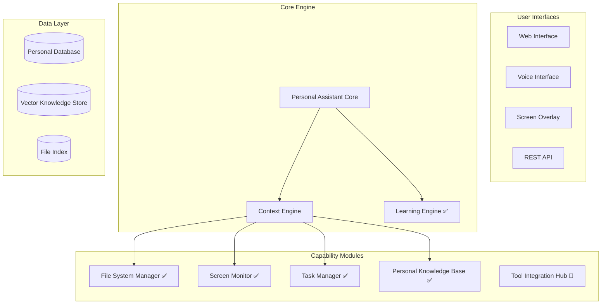

# Project Overview - Personal Assistant Enhancement

## Vision
Transform the existing Self-Improving AI Assistant into a comprehensive personal assistant with file system access, personalized learning capabilities, and screen monitoring features.

## Current Status
- **Phase**: Implementation (Task 7 completed)
- **Completion**: ~39% (7 of 18 tasks completed)
- **Next Task**: Tool Integration Hub

## Key Capabilities Being Added

### 🗂️ File System Management
- Secure file access with user permission controls
- Content analysis and indexing
- File organization and management
- **Status**: ✅ Complete

### 🖥️ Screen Monitoring
- Real-time screen capture and analysis
- OCR and content extraction
- Privacy-controlled monitoring
- **Status**: ✅ Complete

### 🧠 Learning Engine
- Personalized learning from interactions
- Behavior pattern recognition
- Adaptive responses and suggestions
- **Status**: ✅ Complete

### 📋 Task Management
- Intelligent task and project tracking
- Deadline management and reminders
- Productivity analytics
- **Status**: ✅ Complete

### 📚 Personal Knowledge Base
- Document indexing and semantic search
- Knowledge extraction and entity recognition
- Context-aware information retrieval
- **Status**: ✅ Complete

### 🎯 Personal Assistant Core
- Central orchestration of all capabilities
- Request routing and context management
- Multi-modal interaction support
- **Status**: ✅ Integration Complete, 🔄 Multi-modal in progress

## Architecture Overview

## Related Notes
- [[requirements-map]] - Detailed requirements tracking
- [[task-progress]] - Current task status and progress
- [[architecture-overview]] - Technical architecture details
- [[component-maps/personal-assistant-core]] - Core component details