# Project Overview - Personal Assistant Enhancement

## Vision
Transform the existing Self-Improving AI Assistant into a comprehensive personal assistant with file system access, personalized learning capabilities, and screen monitoring features.

## Current Status
- **Phase**: Implementation (Task 7 completed)
- **Completion**: ~39% (7 of 18 tasks completed)
- **Next Task**: Tool Integration Hub

## Key Capabilities Being Added

### 🗂️ File System Management
- Secure file access with user permission controls
- Content analysis and indexing
- File organization and management
- **Status**: ✅ Complete

### 🖥️ Screen Monitoring
- Real-time screen capture and analysis
- OCR and content extraction
- Privacy-controlled monitoring
- **Status**: ✅ Complete

### 🧠 Learning Engine
- Personalized learning from interactions
- Behavior pattern recognition
- Adaptive responses and suggestions
- **Status**: ✅ Complete

### 📋 Task Management
- Intelligent task and project tracking
- Deadline management and reminders
- Productivity analytics
- **Status**: ✅ Complete

### 📚 Personal Knowledge Base
- Document indexing and semantic search
- Knowledge extraction and entity recognition
- Context-aware information retrieval
- **Status**: ✅ Complete

### 🎯 Personal Assistant Core
- Central orchestration of all capabilities
- Request routing and context management
- Multi-modal interaction support
- **Status**: ✅ Integration Complete, 🔄 Multi-modal in progress

## Architecture Overview

```mermaid
graph TB
    subgraph "User Interfaces"
        WebUI[Web Interface]
        VoiceUI[Voice Interface]
        ScreenOverlay[Screen Overlay]
        API[REST API]
    end
    
    subgraph "Core Engine"
        PACore[Personal Assistant Core]
        ContextEngine[Context Engine]
        LearningEngine[Learning Engine ✅]
    end
    
    subgraph "Capability Modules"
        FileManager[File System Manager ✅]
        ScreenMonitor[Screen Monitor ✅]
        TaskManager[Task Manager ✅]
        KnowledgeBase[Personal Knowledge Base ✅]
        IntegrationHub[Tool Integration Hub 🔄]
    end
    
    subgraph "Data Layer"
        PersonalDB[(Personal Database)]
        VectorStore[(Vector Knowledge Store)]
        FileIndex[(File Index)]
    end
    
    PACore --> ContextEngine
    PACore --> LearningEngine
    ContextEngine --> FileManager
    ContextEngine --> ScreenMonitor
    ContextEngine --> TaskManager
    ContextEngine --> KnowledgeBase
```

## Related Notes

### Core Documentation
- [[requirements-map]] - Detailed requirements tracking and completion status
- [[task-progress]] - Current task status and implementation progress
- [[architecture-overview]] - Technical architecture and system design
- [[educational-assessment]] - Assessment of notes as university study material

### Component Documentation
- [[component-maps/personal-assistant-core]] - Core orchestrator component details
- [[component-maps/multi-modal-interaction]] - Multi-modal interaction system
- [[component-maps/README]] - All component documentation index

### Team Resources
- [[team-onboarding/README]] - Complete team onboarding guide
- [[team-onboarding/project-overview-complete]] - Comprehensive project overview
- [[team-onboarding/development-guide]] - Development workflow and practices
- [[team-onboarding/technical-concepts]] - Core patterns and implementation concepts
- [[team-onboarding/architecture-deep-dive]] - Detailed system architecture analysis

### Progress Tracking
- [[daily-logs/2025-08-17]] - Latest development progress and achievements
- [[daily-logs/README]] - Historical progress tracking and decisions

### Quick Navigation
- [[README]] - Main knowledge base navigation hub
- [[task-progress#Next Steps]] - Upcoming development milestones
- [[requirements-map#Progress Summary]] - Overall completion metrics