# Team Onboarding - Welcome to Personal Assistant Enhancement

## 🎯 Welcome New Team Member!

This directory contains everything you need to understand and contribute to the Personal Assistant Enhancement project. We've organized the information to help you get up to speed quickly and effectively.

## 📚 Learning Path

### Phase 1: Understanding the Project (Days 1-3)
Start here to understand what we're building and why:

1. **[[project-overview-complete]]** - Complete project overview
   - Project vision and goals
   - System architecture overview
   - Current status and completed features
   - Technology stack and tools

2. **[[architecture-deep-dive]]** - Technical architecture details
   - Architectural philosophy and decisions
   - Request processing flow
   - Multi-modal interaction system
   - Privacy and security architecture
   - Data storage and management

### Phase 2: Technical Deep Dive (Days 4-7)
Dive into the technical implementation:

3. **[[technical-concepts]]** - Core patterns and concepts
   - Request-response patterns
   - Capability module architecture
   - AI/ML integration patterns
   - Security and privacy patterns
   - Performance optimization patterns

4. **[[development-guide]]** - Practical development guide
   - Quick start setup
   - Development workflow
   - Adding new features step-by-step
   - Testing best practices
   - Debugging and performance monitoring

### Phase 3: Hands-On Development (Week 2+)
Start contributing to the project:

5. **Practice Tasks** - Suggested first contributions
6. **Code Review Process** - How we maintain quality
7. **Team Collaboration** - Communication and workflow

## 🗺️ Project Navigation Map

### Core Documentation
- **[[../project-overview]]** - High-level project status
- **[[../requirements-map]]** - Requirements tracking and status
- **[[../task-progress]]** - Implementation progress and next steps
- **[[../architecture-overview]]** - Technical architecture overview

### Component Documentation
- **[[../component-maps/personal-assistant-core]]** - Central orchestrator
- **[[../component-maps/multi-modal-interaction]]** - Multi-modal system
- **[[../component-maps/]]** - All component documentation

### Daily Progress
- **[[../daily-logs/]]** - Development progress logs
- **[[../daily-logs/2025-08-17]]** - Latest progress update

## 🛠️ Quick Setup Checklist

### Prerequisites
- [ ] Python 3.10+ installed
- [ ] Git configured with your credentials
- [ ] Code editor (VS Code recommended)
- [ ] Basic understanding of async/await in Python

### Environment Setup
```bash
# 1. Clone and setup
git clone <repository-url>
cd personal-assistant-enhancement
python -m venv venv
source venv/bin/activate  # Windows: venv\Scripts\activate

# 2. Install dependencies
pip install -r requirements.txt

# 3. Verify setup
python -m pytest tests/test_multi_modal_simple.py -v

# 4. Start development server
uvicorn app.main:app --reload --host 0.0.0.0 --port 8000
```

### First Steps
- [ ] Read [[project-overview-complete]]
- [ ] Run the test suite and understand the structure
- [ ] Explore the main components in `app/` directory
- [ ] Set up your development environment
- [ ] Join team communication channels

## 🎓 Key Concepts to Understand

### 1. Multi-Modal Interaction
Users can interact through **voice**, **text**, or **visual** interfaces seamlessly. The system preserves context when switching between modes.

**Example**: User starts typing → gets text completions → switches to voice → asks question → gets visual and spoken response.

### 2. Privacy-First Architecture
All user data stays local with explicit consent for each operation. Users have complete control over their data.

### 3. Capability Modules
Each major feature (file access, voice processing, screen monitoring) is a separate, testable module that can be enabled/disabled independently.

### 4. Context Awareness
The assistant understands what you're working on and provides relevant help based on your current activity, files, and applications.

### 5. Accessibility-First Design
Built-in support for screen readers, keyboard navigation, high contrast modes, and other accessibility features.

## 🏗️ System Architecture Overview

```mermaid
graph TB
    subgraph "User Interfaces"
        WebUI[Web Interface]
        VoiceUI[Voice Interface ✅]
        ScreenOverlay[Screen Overlay ✅]
        API[REST API]
    end
    
    subgraph "Core Engine"
        PACore[Personal Assistant Core ✅]
        InteractionManager[Interaction Mode Manager ✅]
        LearningEngine[Learning Engine ✅]
    end
    
    subgraph "Capability Modules"
        FileManager[File System Manager ✅]
        ScreenMonitor[Screen Monitor ✅]
        TaskManager[Task Manager ✅]
        KnowledgeBase[Personal Knowledge Base ✅]
        VoiceProcessor[Voice Processor ✅]
        TextCompletion[Text Completion ✅]
        AccessibilityManager[Accessibility Manager ✅]
    end
    
    subgraph "Data Layer"
        PersonalDB[(Personal Database)]
        VectorStore[(Vector Knowledge Store)]
        FileIndex[(File Index)]
    end
```



## 📊 Current Project Status

### Completed Features ✅ (39% complete)
1. **File System Access**: Secure file operations with permissions
2. **Screen Monitoring**: Context-aware screen analysis
3. **Learning Engine**: Behavior adaptation and personalization
4. **Task Management**: Intelligent project and deadline tracking
5. **Personal Knowledge Base**: Vector-based knowledge storage
6. **Personal Assistant Core**: Central orchestration and routing
7. **Multi-Modal Interaction**: Voice, visual, and accessibility support

### Next Milestones
- **Task 8**: Tool Integration Hub (external service connections)
- **Task 9**: Enhanced Privacy Controls (granular permissions)
- **Task 10**: Proactive Assistance Engine (automation suggestions)

## 🤝 Team Culture & Values

### Our Values
- **Quality First**: We write clean, tested, documented code
- **Privacy Matters**: User privacy and security are non-negotiable
- **Accessibility**: We build for everyone, including users with disabilities
- **Collaboration**: We help each other learn and grow
- **Continuous Learning**: We stay curious and keep improving

### Communication
- **Daily Standups**: Share progress and blockers
- **Code Reviews**: All changes require peer review
- **Documentation**: Keep docs updated as you code
- **Questions Welcome**: No question is too basic - ask away!

### Quality Standards
- **Test Coverage**: Minimum 80% coverage for new code
- **Performance**: Real-time features must respond within 500ms
- **Accessibility**: All UI must meet WCAG 2.1 AA standards
- **Security**: All data access must be permission-controlled

## 🎯 Your First Week Goals

### Day 1-2: Project Understanding
- [ ] Read [[project-overview-complete]] thoroughly
- [ ] Understand the multi-modal interaction concept
- [ ] Set up development environment
- [ ] Run all tests successfully

### Day 3-4: Technical Deep Dive
- [ ] Study [[architecture-deep-dive]] and [[technical-concepts]]
- [ ] Explore the main components in the codebase
- [ ] Understand the request-response flow
- [ ] Try making a small change and running tests

### Day 5: First Contribution
- [ ] Pick a small bug fix or documentation improvement
- [ ] Follow the development workflow in [[development-guide]]
- [ ] Create your first pull request
- [ ] Go through the code review process

## 🆘 Getting Help

### When You're Stuck
1. **Check Documentation**: Start with these onboarding docs
2. **Search Codebase**: Look for similar patterns in existing code
3. **Ask Questions**: Use team communication channels
4. **Pair Programming**: Work with a team member
5. **Code Review**: Get feedback on your approach

### Common Resources
- **Obsidian Notes**: All project knowledge is here
- **Test Files**: Great examples of how components work
- **Component Maps**: Technical documentation for each module
- **Daily Logs**: See how features were implemented

### Team Contacts
- **Architecture Questions**: Ask about system design decisions
- **Implementation Help**: Get help with coding patterns
- **Testing Guidance**: Learn our testing approaches
- **Code Review**: Get feedback on your contributions

## 🚀 Ready to Start?

1. **Begin with [[project-overview-complete]]** - Get the big picture
2. **Set up your environment** - Follow the setup checklist above
3. **Explore the codebase** - Start with `app/personal_assistant_core.py`
4. **Run the tests** - Understand how we verify functionality
5. **Ask questions** - We're here to help you succeed!

Welcome to the team! We're excited to have you contribute to building the future of personal AI assistance. 🎉

---

*This documentation is living and evolving. If you find gaps or have suggestions for improvement, please contribute back to help future team members!*

## Related Documentation & Cross-References

### Core Project Information
- [[../project-overview]] - High-level project status and vision
- [[../requirements-map]] - Requirements tracking and completion status
- [[../task-progress]] - Implementation progress and current milestones
- [[../architecture-overview]] - System architecture overview

### Educational Resources
- [[../educational-assessment]] - Assessment as university study material
- [[../educational-assessment#University Course Applications]] - Specific course applications
- [[../educational-assessment#Learning Theory Application]] - Pedagogical approach

### Component Documentation
- [[../component-maps/personal-assistant-core]] - Core orchestrator implementation
- [[../component-maps/multi-modal-interaction]] - Multi-modal interaction system
- [[../component-maps/README]] - Complete component documentation index

### Progress Tracking
- [[../daily-logs/2025-08-17]] - Latest development achievements
- [[../daily-logs/README]] - Historical progress and decision tracking

### Detailed Learning Materials
- [[project-overview-complete]] - Everything you need to know about the project
- [[development-guide]] - Practical development workflow and examples
- [[technical-concepts]] - Core patterns and implementation concepts
- [[architecture-deep-dive]] - Detailed system architecture analysis

### Navigation
- [[../README]] - Main knowledge base hub
- [[../README#For New Team Members]] - Quick navigation for onboarding
- [[../README#Learning Paths]] - Structured learning progression