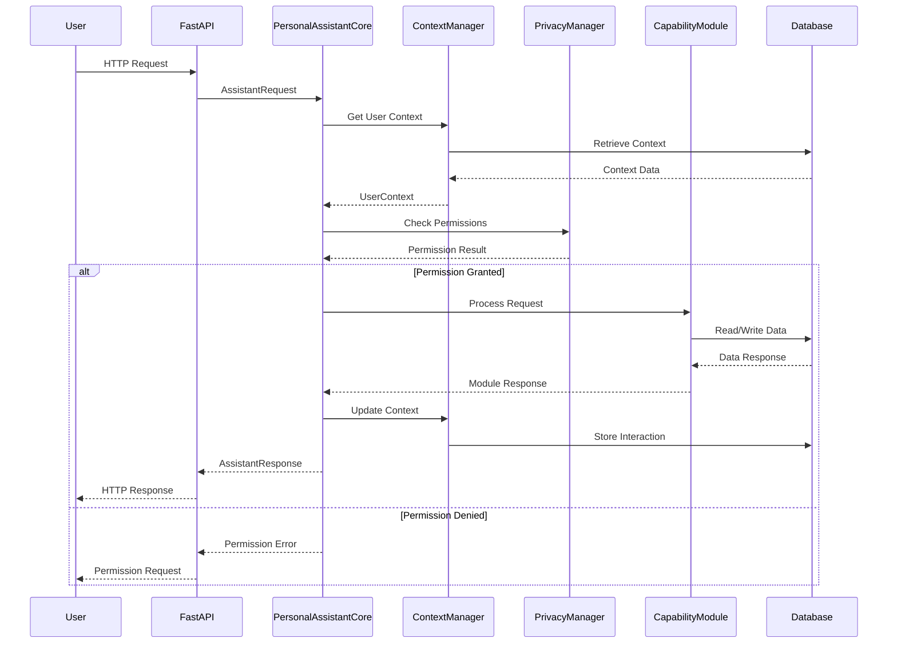
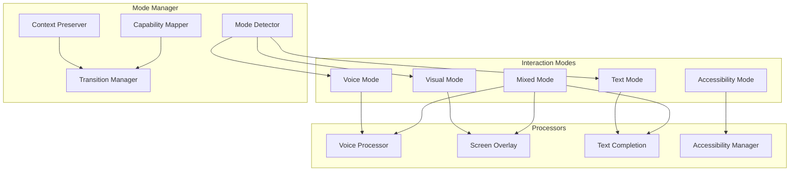
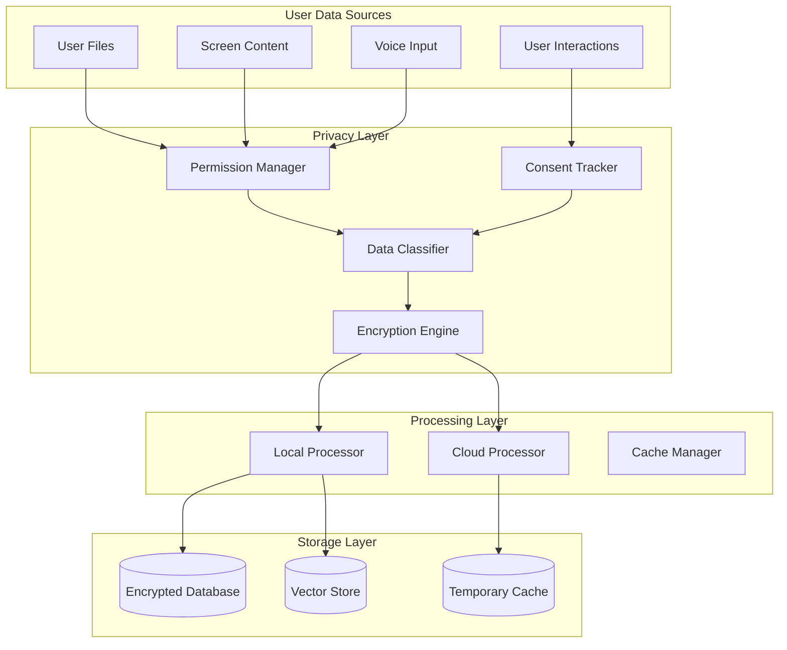

# Architecture Deep Dive - System Design & Decisions

## 🏛️ Architectural Philosophy

### Design Principles
1. **Modularity**: Each capability is a separate, testable module
2. **Privacy First**: User data stays local with explicit consent
3. **Accessibility First**: WCAG 2.1 AA compliance built-in
4. **Progressive Enhancement**: Core features work without advanced capabilities
5. **Async by Default**: Non-blocking operations for responsiveness
6. **Fail Gracefully**: System continues working when components fail

### Key Architectural Decisions

#### Why FastAPI?
- **Performance**: ASGI-based for high concurrency
- **Type Safety**: Built-in Pydantic validation
- **Documentation**: Automatic OpenAPI/Swagger docs
- **Async Support**: Native async/await support
- **Ecosystem**: Rich ecosystem of extensions

#### Why SQLite + FAISS?
- **SQLite**: Local storage, no server required, ACID compliance
- **FAISS**: Fast vector similarity search for semantic knowledge
- **Privacy**: All data stays on user's machine
- **Performance**: Optimized for local operations
- **Simplicity**: No complex database setup required

#### Why Modular Architecture?
- **Independent Development**: Teams can work on different modules
- **Testing**: Each module can be tested in isolation
- **Deployment**: Modules can be enabled/disabled per user
- **Maintenance**: Easier to debug and update specific features
- **Extensibility**: New capabilities can be added without core changes

## 🔄 Request Processing Architecture

### Request Flow Diagram


### Request Types & Routing

#### Core Request Types
```python
class RequestType(Enum):
    # Basic interactions
    QUERY = "query"                    # General questions
    COMMAND = "command"                # Action commands
    
    # File operations
    FILE_OPERATION = "file_operation"  # File system access
    
    # Context management
    CONTEXT_UPDATE = "context_update"  # Update user context
    SCREEN_MONITORING = "screen_monitoring"  # Screen analysis
    
    # Multi-modal interactions ✅
    VOICE_COMMAND = "voice_command"    # Voice input
    TEXT_COMPLETION = "text_completion"  # Text suggestions
    VISUAL_FEEDBACK = "visual_feedback"  # Screen overlays
    MODE_SWITCH = "mode_switch"        # Interaction mode changes
    
    # System management
    PERMISSION_REQUEST = "permission_request"  # Permission handling
    PRIVACY_CONTROL = "privacy_control"  # Privacy settings
    ACCESSIBILITY_REQUEST = "accessibility_request"  # Accessibility features
    
    # Learning and knowledge
    TASK_MANAGEMENT = "task_management"  # Task operations
    KNOWLEDGE_SEARCH = "knowledge_search"  # Knowledge queries
    LEARNING_FEEDBACK = "learning_feedback"  # User feedback
```

#### Routing Logic
```python
async def _route_request(self, request: AssistantRequest, context: UserContext) -> AssistantResponse:
    """Route request to appropriate handler based on type and content"""
    
    # Route to specific handlers
    handler_map = {
        RequestType.QUERY: self._handle_query,
        RequestType.VOICE_COMMAND: self._handle_voice_command,
        RequestType.TEXT_COMPLETION: self._handle_text_completion,
        RequestType.VISUAL_FEEDBACK: self._handle_visual_feedback,
        RequestType.MODE_SWITCH: self._handle_mode_switch,
        RequestType.ACCESSIBILITY_REQUEST: self._handle_accessibility_request,
        # ... other handlers
    }
    
    handler = handler_map.get(request.request_type)
    if handler:
        return await handler(request, context)
    else:
        return self._handle_unknown_request(request)
```

## 🧠 Multi-Modal Architecture Deep Dive

### Interaction Mode Coordination


### Mode Capabilities Matrix
| Mode | Voice Input | Voice Output | Text Input | Text Output | Visual Feedback | Screen Overlay | Keyboard Nav | Screen Reader |
|------|-------------|--------------|------------|-------------|-----------------|----------------|--------------|---------------|
| Text | ❌ | ❌ | ✅ | ✅ | ✅ | ❌ | ❌ | ❌ |
| Voice | ✅ | ✅ | ❌ | ❌ | ✅ | ✅ | ❌ | ❌ |
| Visual | ❌ | ❌ | ✅ | ✅ | ✅ | ✅ | ❌ | ❌ |
| Mixed | ✅ | ✅ | ✅ | ✅ | ✅ | ✅ | ❌ | ❌ |
| Accessibility | ✅ | ✅ | ✅ | ✅ | ✅ | ❌ | ✅ | ✅ |

### Context Preservation Strategy
```python
class InteractionContext:
    def __init__(self):
        self.conversation_history = []
        self.user_preferences = {}
        self.active_tasks = []
        self.mode_switches = 0
    
    async def preserve_context_during_switch(self, old_mode, new_mode):
        # Save current state
        context_snapshot = {
            "mode": old_mode.value,
            "timestamp": datetime.now(),
            "conversation_tail": self.conversation_history[-5:],
            "active_context": self.get_active_context()
        }
        
        # Add to history
        self.conversation_history.append({
            "type": "mode_switch",
            "data": context_snapshot
        })
        
        # Update counters
        self.mode_switches += 1
        
        # Adapt to new mode
        await self.adapt_to_mode(new_mode)
```

## 🔒 Privacy & Security Architecture

### Privacy-First Data Flow


### Permission System Architecture
```python
class PermissionType(Enum):
    FILE_READ = "file_read"
    FILE_WRITE = "file_write"
    SCREEN_MONITOR = "screen_monitor"
    VOICE_RECORD = "voice_record"
    PERSONAL_DATA = "personal_data"
    LEARNING = "learning"
    CLOUD_SYNC = "cloud_sync"

class PermissionScope:
    def __init__(self, resource_type: str, resource_path: str = "*", 
                 time_limit: Optional[datetime] = None):
        self.resource_type = resource_type
        self.resource_path = resource_path
        self.time_limit = time_limit
        self.granted_at = datetime.now()

class PrivacySecurityManager:
    def __init__(self):
        self.permissions = {}  # user_id -> {permission_type -> [scopes]}
        self.consent_log = []  # Audit trail
        self.encryption_keys = {}  # user_id -> encryption_key
    
    async def check_permission(self, user_id: str, permission_type: PermissionType, 
                             resource_path: str = None) -> bool:
        user_permissions = self.permissions.get(user_id, {})
        scopes = user_permissions.get(permission_type, [])
        
        for scope in scopes:
            if self._scope_matches(scope, resource_path):
                if not scope.time_limit or datetime.now() < scope.time_limit:
                    return True
        
        return False
```

### Data Classification System
```python
class DataCategory(Enum):
    PUBLIC = "public"           # No privacy concerns
    PERSONAL = "personal"       # Personal but not sensitive
    SENSITIVE = "sensitive"     # Requires encryption
    CONFIDENTIAL = "confidential"  # Highest protection level

class DataClassifier:
    def classify_data(self, data: Any, context: Dict[str, Any]) -> DataCategory:
        # File content classification
        if context.get("source") == "file":
            if self._contains_credentials(data):
                return DataCategory.CONFIDENTIAL
            elif self._contains_personal_info(data):
                return DataCategory.SENSITIVE
            else:
                return DataCategory.PERSONAL
        
        # Screen content classification
        elif context.get("source") == "screen":
            if self._contains_passwords(data):
                return DataCategory.CONFIDENTIAL
            elif self._contains_private_info(data):
                return DataCategory.SENSITIVE
            else:
                return DataCategory.PERSONAL
        
        # Default classification
        return DataCategory.PERSONAL
```

## 🧩 Component Integration Patterns

### Dependency Injection Pattern
```python
class PersonalAssistantCore:
    def __init__(self, db_path: str = "personal_assistant.db"):
        # Core dependencies
        self.db = PersonalDatabase(db_path)
        self.context_manager = UserContextManager(db_path)
        self.privacy_manager = PrivacySecurityManager(db_path)
        
        # Capability modules (injected)
        self._capability_modules = {}
        self._initialize_capability_modules()
    
    def _initialize_capability_modules(self):
        """Initialize capability modules with dependency injection"""
        # File system manager with privacy and context dependencies
        self._capability_modules['file_system'] = FileSystemManager(
            privacy_manager=self.privacy_manager,
            context_manager=self.context_manager
        )
        
        # Learning engine with context dependency
        self._capability_modules['learning'] = LearningEngine(
            db_path=self.db.db_path,
            context_manager=self.context_manager
        )
        
        # Multi-modal interaction manager with all dependencies
        self._capability_modules['interaction_manager'] = InteractionModeManager(
            voice_settings=VoiceSettings(),
            completion_settings=CompletionSettings(),
            accessibility_settings=AccessibilitySettings()
        )
```

### Event-Driven Communication
```python
class EventBus:
    def __init__(self):
        self.subscribers = {}
    
    def subscribe(self, event_type: str, handler: Callable):
        if event_type not in self.subscribers:
            self.subscribers[event_type] = []
        self.subscribers[event_type].append(handler)
    
    async def publish(self, event_type: str, data: Any):
        if event_type in self.subscribers:
            for handler in self.subscribers[event_type]:
                try:
                    await handler(data)
                except Exception as e:
                    logger.error(f"Error in event handler: {e}")

# Usage throughout the system
event_bus = EventBus()

# Components subscribe to events they care about
event_bus.subscribe("user_preference_changed", learning_engine.update_preferences)
event_bus.subscribe("file_accessed", knowledge_base.index_file)
event_bus.subscribe("screen_context_changed", context_manager.update_screen_context)

# Components publish events when things happen
await event_bus.publish("user_preference_changed", {
    "user_id": "user123",
    "preference": "voice_speed",
    "value": 1.2
})
```

### Plugin Architecture
```python
class CapabilityPlugin:
    """Base class for capability plugins"""
    
    def __init__(self, name: str, version: str):
        self.name = name
        self.version = version
        self.enabled = True
    
    async def initialize(self, core: 'PersonalAssistantCore'):
        """Initialize plugin with core system access"""
        pass
    
    async def process_request(self, request: AssistantRequest) -> Optional[AssistantResponse]:
        """Process requests this plugin can handle"""
        return None
    
    def get_supported_request_types(self) -> List[RequestType]:
        """Return list of request types this plugin supports"""
        return []
    
    async def cleanup(self):
        """Clean up plugin resources"""
        pass

class PluginManager:
    def __init__(self):
        self.plugins = {}
        self.request_type_map = {}
    
    def register_plugin(self, plugin: CapabilityPlugin):
        self.plugins[plugin.name] = plugin
        
        # Map request types to plugins
        for request_type in plugin.get_supported_request_types():
            if request_type not in self.request_type_map:
                self.request_type_map[request_type] = []
            self.request_type_map[request_type].append(plugin)
    
    async def process_request(self, request: AssistantRequest) -> Optional[AssistantResponse]:
        plugins = self.request_type_map.get(request.request_type, [])
        
        for plugin in plugins:
            if plugin.enabled:
                response = await plugin.process_request(request)
                if response:
                    return response
        
        return None
```

## 📊 Data Architecture & Storage

### Database Schema Design
```sql
-- User management
CREATE TABLE users (
    id TEXT PRIMARY KEY,
    created_at TIMESTAMP DEFAULT CURRENT_TIMESTAMP,
    preferences TEXT,  -- JSON blob
    encryption_key_hash TEXT
);

-- Interaction history
CREATE TABLE interactions (
    id TEXT PRIMARY KEY,
    user_id TEXT REFERENCES users(id),
    interaction_type TEXT,
    content TEXT,
    response TEXT,
    context_data TEXT,  -- JSON blob
    metadata TEXT,      -- JSON blob
    timestamp TIMESTAMP DEFAULT CURRENT_TIMESTAMP,
    feedback_score REAL
);

-- File index
CREATE TABLE file_index (
    id TEXT PRIMARY KEY,
    user_id TEXT REFERENCES users(id),
    file_path TEXT,
    file_hash TEXT,
    content_summary TEXT,
    metadata TEXT,      -- JSON blob
    indexed_at TIMESTAMP DEFAULT CURRENT_TIMESTAMP,
    last_accessed TIMESTAMP
);

-- Task management
CREATE TABLE tasks (
    id TEXT PRIMARY KEY,
    user_id TEXT REFERENCES users(id),
    title TEXT,
    description TEXT,
    status TEXT,
    priority INTEGER,
    due_date TIMESTAMP,
    created_at TIMESTAMP DEFAULT CURRENT_TIMESTAMP,
    completed_at TIMESTAMP,
    metadata TEXT       -- JSON blob
);

-- Knowledge base entries
CREATE TABLE knowledge_items (
    id TEXT PRIMARY KEY,
    user_id TEXT REFERENCES users(id),
    content TEXT,
    summary TEXT,
    source_file TEXT,
    source_type TEXT,
    embedding_id TEXT,  -- Reference to FAISS vector
    created_at TIMESTAMP DEFAULT CURRENT_TIMESTAMP,
    metadata TEXT       -- JSON blob
);

-- Privacy and permissions
CREATE TABLE permissions (
    id TEXT PRIMARY KEY,
    user_id TEXT REFERENCES users(id),
    permission_type TEXT,
    resource_scope TEXT,
    granted_at TIMESTAMP DEFAULT CURRENT_TIMESTAMP,
    expires_at TIMESTAMP,
    metadata TEXT       -- JSON blob
);
```

### Vector Storage Architecture
```python
class VectorStore:
    def __init__(self, dimension: int = 384):
        self.dimension = dimension
        self.index = faiss.IndexFlatIP(dimension)  # Inner product for similarity
        self.id_map = {}  # vector_id -> metadata
        self.next_id = 0
    
    def add_vector(self, embedding: np.ndarray, metadata: Dict[str, Any]) -> str:
        """Add vector to store and return ID"""
        vector_id = str(self.next_id)
        self.next_id += 1
        
        # Add to FAISS index
        self.index.add(embedding.reshape(1, -1))
        
        # Store metadata
        self.id_map[vector_id] = metadata
        
        return vector_id
    
    def search_similar(self, query_embedding: np.ndarray, k: int = 5) -> List[Dict[str, Any]]:
        """Find k most similar vectors"""
        scores, indices = self.index.search(query_embedding.reshape(1, -1), k)
        
        results = []
        for i, (score, idx) in enumerate(zip(scores[0], indices[0])):
            if idx != -1:  # Valid result
                vector_id = str(idx)
                metadata = self.id_map.get(vector_id, {})
                results.append({
                    "id": vector_id,
                    "score": float(score),
                    "metadata": metadata
                })
        
        return results
```

### Caching Strategy
```python
class CacheManager:
    def __init__(self):
        self.memory_cache = {}  # In-memory cache
        self.redis_cache = None  # Redis for distributed caching
        self.cache_stats = {"hits": 0, "misses": 0}
    
    async def get(self, key: str) -> Optional[Any]:
        # Try memory cache first
        if key in self.memory_cache:
            entry = self.memory_cache[key]
            if not self._is_expired(entry):
                self.cache_stats["hits"] += 1
                return entry["value"]
            else:
                del self.memory_cache[key]
        
        # Try Redis cache
        if self.redis_cache:
            value = await self.redis_cache.get(key)
            if value:
                self.cache_stats["hits"] += 1
                # Promote to memory cache
                self.memory_cache[key] = {
                    "value": value,
                    "expires_at": time.time() + 300  # 5 minutes
                }
                return value
        
        self.cache_stats["misses"] += 1
        return None
    
    async def set(self, key: str, value: Any, ttl: int = 300):
        # Store in memory cache
        self.memory_cache[key] = {
            "value": value,
            "expires_at": time.time() + ttl
        }
        
        # Store in Redis cache
        if self.redis_cache:
            await self.redis_cache.setex(key, ttl, value)
```

## 🚀 Performance Architecture

### Async Processing Pipeline
```python
class AsyncProcessor:
    def __init__(self, max_workers: int = 10):
        self.semaphore = asyncio.Semaphore(max_workers)
        self.task_queue = asyncio.Queue()
        self.workers = []
        self.running = False
    
    async def start(self):
        self.running = True
        # Start worker tasks
        for i in range(self.semaphore._value):
            worker = asyncio.create_task(self._worker(f"worker-{i}"))
            self.workers.append(worker)
    
    async def _worker(self, name: str):
        while self.running:
            try:
                task = await self.task_queue.get()
                async with self.semaphore:
                    await task()
                self.task_queue.task_done()
            except Exception as e:
                logger.error(f"Error in {name}: {e}")
    
    async def submit_task(self, coro):
        await self.task_queue.put(coro)
    
    async def stop(self):
        self.running = False
        # Wait for current tasks to complete
        await self.task_queue.join()
        # Cancel workers
        for worker in self.workers:
            worker.cancel()
```

### Resource Management
```python
class ResourceManager:
    def __init__(self):
        self.memory_limit = 500 * 1024 * 1024  # 500MB
        self.cpu_limit = 80  # 80% CPU usage
        self.active_tasks = set()
    
    async def acquire_resources(self, task_id: str, memory_needed: int) -> bool:
        current_memory = self._get_memory_usage()
        current_cpu = self._get_cpu_usage()
        
        if (current_memory + memory_needed > self.memory_limit or 
            current_cpu > self.cpu_limit):
            return False
        
        self.active_tasks.add(task_id)
        return True
    
    def release_resources(self, task_id: str):
        self.active_tasks.discard(task_id)
    
    def _get_memory_usage(self) -> int:
        import psutil
        process = psutil.Process()
        return process.memory_info().rss
    
    def _get_cpu_usage(self) -> float:
        import psutil
        return psutil.cpu_percent(interval=0.1)
```

This deep dive into the architecture should give you a comprehensive understanding of how all the pieces fit together. The system is designed to be modular, secure, performant, and accessible while maintaining a clean separation of concerns and clear data flow patterns.