# Complete Project Overview - Personal Assistant Enhancement

## 🎯 Project Vision & Mission

### What We're Building
We're transforming an existing **Self-Improving AI Assistant** into a comprehensive **Personal Assistant** that can:
- Access and manage files on your computer
- Learn from your behavior and adapt to your preferences
- Monitor your screen for contextual assistance
- Interact through voice, text, and visual interfaces
- Provide proactive suggestions and automation
- Maintain complete privacy and security control

### Why This Matters
Current AI assistants are limited to text conversations. Our assistant becomes a true **productivity companion** that:
- Understands your work context
- Adapts to your preferences over time
- Provides assistance through multiple interaction modes
- Respects your privacy with local processing
- Integrates seamlessly with your existing tools

## 🏗️ System Architecture Overview

### High-Level Architecture

```mermaid
graph TB
    subgraph "User Interface Layer"
        WebUI[Web Interface]
        VoiceUI[Voice Interface ✅]
        ScreenOverlay[Screen Overlay ✅]
        API[REST API]
    end
    
    subgraph "Core Assistant Engine"
        PACore[Personal Assistant Core ✅]
        ConversationManager[Conversation Manager]
        ContextEngine[Context Engine]
        LearningEngine[Learning Engine ✅]
        InteractionManager[Interaction Mode Manager ✅]
    end
    
    subgraph "Capability Modules"
        FileManager[File System Manager ✅]
        ScreenMonitor[Screen Monitor ✅]
        TaskManager[Task Manager ✅]
        KnowledgeBase[Personal Knowledge Base ✅]
        VoiceProcessor[Voice Processor ✅]
        TextCompletion[Text Completion ✅]
        AccessibilityManager[Accessibility Manager ✅]
    end
    
    subgraph "Data Layer"
        PersonalDB[(Personal Database)]
        VectorStore[(Vector Knowledge Store ✅)]
        FileIndex[(File Index ✅)]
        UserPrefs[(User Preferences ✅)]
        ContextCache[(Context Cache)]
    end
    
    subgraph "External Integrations"
        CloudServices[Cloud Services ⏳]
        ProductivityTools[Productivity Tools ⏳]
        DevTools[Development Tools ⏳]
        SystemAPIs[System APIs ✅]
    end
```


### Architecture Principles
1. **Modular Design**: Each capability is a separate, testable module
2. **Privacy First**: Local processing with user control over data
3. **Extensible**: Easy to add new capabilities and integrations
4. **Accessible**: WCAG 2.1 AA compliance built-in
5. **Performance**: Real-time processing with async operations
6. **Resilient**: Graceful degradation when components unavailable

## 🧩 Core Components Deep Dive

### 1. Personal Assistant Core (`app/personal_assistant_core.py`)
**Role**: Central orchestrator and request router

**Key Responsibilities**:
- Route requests to appropriate capability modules
- Maintain user context and session state
- Coordinate multi-modal interactions
- Enforce privacy and security policies
- Handle 15 different request types

**Request Types Handled**:
- `QUERY` - General questions and information requests
- `COMMAND` - Action commands
- `FILE_OPERATION` - File system operations
- `VOICE_COMMAND` - Voice-based interactions ✅
- `TEXT_COMPLETION` - Intelligent text suggestions ✅
- `VISUAL_FEEDBACK` - Screen overlays and notifications ✅
- `MODE_SWITCH` - Interaction mode changes ✅
- `ACCESSIBILITY_REQUEST` - Accessibility features ✅
- And more...

### 2. Multi-Modal Interaction System ✅

#### Voice Processor (`app/voice_processor.py`)
**Purpose**: Handle voice input and output

**Capabilities**:
- **Speech Recognition**: Convert speech to text using Google Speech API
- **Text-to-Speech**: Generate voice responses with configurable voices
- **Command Parsing**: Extract intents and entities from voice commands
- **Wake Word Support**: Optional wake word activation
- **Noise Filtering**: Handle background noise
- **Mock Support**: Graceful fallback when hardware unavailable

**Command Patterns Supported**:
- File operations: "open file document.pdf"
- Task management: "create task finish project"
- Screen monitoring: "what am I working on"
- Knowledge search: "find information about Python"
- General queries: "help me with coding"

#### Screen Overlay (`app/screen_overlay.py`)
**Purpose**: Provide visual feedback and contextual information

**Overlay Types**:
- **Notifications**: Temporary status messages
- **Context Info**: Persistent contextual information
- **Tooltips**: Help text at specific locations
- **Progress**: Task progress indicators
- **Confirmations**: User confirmation dialogs
- **Annotations**: Screen markup and highlights

**Features**:
- Multiple positioning options (corners, center, custom)
- Animation support (fade in/out)
- Interactive buttons and callbacks
- Automatic expiration
- Priority-based layering

#### Text Completion (`app/text_completion.py`)
**Purpose**: Intelligent text completion and suggestions

**Context Types Supported**:
- **Code**: Programming languages with syntax awareness
- **Email**: Professional email templates and phrases
- **Documents**: Writing assistance and transitions
- **Command Line**: Shell commands and parameters
- **General**: Common words and phrases

**Learning Features**:
- User pattern recognition
- Context-aware suggestions
- Application-specific completions
- Confidence scoring
- Usage frequency tracking

#### Accessibility Manager (`app/accessibility_manager.py`)
**Purpose**: Ensure inclusive design and WCAG compliance

**Features Supported**:
- **Screen Reader**: Integration with NVDA, JAWS, VoiceOver, Orca
- **Keyboard Navigation**: Tab order and keyboard shortcuts
- **High Contrast**: Multiple color schemes for visual accessibility
- **Large Text**: Scalable text and UI elements
- **Voice Control**: Alternative voice-based navigation
- **Reduced Motion**: Minimize animations for motion sensitivity

**Compliance Levels**:
- WCAG 2.1 A, AA, AAA support
- Platform-specific accessibility API integration
- Real-time compliance checking

#### Interaction Mode Manager (`app/interaction_mode_manager.py`)
**Purpose**: Coordinate seamless switching between interaction modes

**Interaction Modes**:
- **TEXT**: Traditional text-based interaction
- **VOICE**: Voice commands and responses
- **VISUAL**: Screen overlays and visual feedback
- **MIXED**: Combination of all modes
- **ACCESSIBILITY**: Enhanced accessibility features

**Key Features**:
- Context preservation across mode switches
- Automatic mode detection based on environment
- Capability management per mode
- Smooth transitions with user feedback

### 3. Capability Modules ✅

#### File System Manager (`app/file_system_manager.py`)
**Purpose**: Secure file system access and management

**Operations Supported**:
- **READ**: Read file contents with permission checks
- **WRITE**: Create and modify files securely
- **LIST**: Directory browsing with filtering
- **SEARCH**: Content-based file search
- **ANALYZE**: Extract metadata and content analysis
- **ORGANIZE**: Intelligent file organization

**Security Features**:
- User permission validation
- Path traversal protection
- File type restrictions
- Audit logging
- Sandboxed operations

#### Screen Monitor (`app/screen_monitor.py`)
**Purpose**: Capture and analyze screen content for context

**Monitoring Modes**:
- **SELECTIVE**: Monitor specific applications
- **FULL**: Complete screen monitoring
- **PRIVACY**: Exclude sensitive content

**Capabilities**:
- OCR text extraction
- Application detection
- Window title analysis
- UI element recognition
- Context summarization

#### Learning Engine (`app/learning_engine.py`)
**Purpose**: Personalized learning and adaptation

**Learning Types**:
- **Behavior Patterns**: User workflow recognition
- **Preferences**: Interface and interaction preferences
- **Feedback Processing**: Learn from user corrections
- **Skill Assessment**: Track user expertise levels
- **Context Adaptation**: Adjust to changing needs

#### Task Manager (`app/task_manager.py`)
**Purpose**: Intelligent task and project management

**Features**:
- Task creation and tracking
- Deadline management
- Project context maintenance
- Progress monitoring
- Productivity analytics
- Proactive reminders

#### Personal Knowledge Base (`app/personal_knowledge_base.py`)
**Purpose**: Build and maintain personalized knowledge

**Capabilities**:
- Document indexing with vector embeddings
- Semantic search and retrieval
- Knowledge extraction and entity recognition
- Context-aware information retrieval
- Knowledge graph construction
- Privacy-controlled sharing

## 📊 Data Models & Storage

### User Context Model
```python
@dataclass
class UserContext:
    user_id: str
    current_activity: str
    active_applications: List[str]
    current_files: List[str]
    recent_interactions: List[Interaction]
    preferences: UserPreferences
    knowledge_state: KnowledgeState
    task_context: TaskContext
```

### Storage Architecture
- **Personal Database**: SQLite for user data and preferences
- **Vector Store**: FAISS for semantic search and knowledge retrieval
- **File Index**: Metadata and content indexing
- **Context Cache**: Redis for real-time context and temporary data

## 🔒 Privacy & Security Architecture

### Privacy-First Design Principles
1. **Data Minimization**: Only collect necessary data
2. **User Control**: Granular permissions and data management
3. **Local Processing**: Sensitive operations performed locally
4. **Encryption**: End-to-end encryption for sensitive data
5. **Transparency**: Clear data usage explanations
6. **Right to Delete**: Complete data removal capabilities

### Security Controls
- **Access Control Matrix**: Component-specific permissions
- **Permission Management**: User consent and permission tracking
- **Audit Logging**: Comprehensive logging of system access
- **Secure Storage**: Encrypted storage with user-specific keys
- **Network Security**: TLS for all communications

## 🧪 Testing Strategy

### Test Coverage
- **Unit Tests**: Individual component functionality
- **Integration Tests**: Cross-component communication
- **Performance Tests**: Real-time processing validation
- **Security Tests**: Permission and access control validation
- **Accessibility Tests**: WCAG compliance verification
- **User Experience Tests**: Multi-modal interaction flows

### Current Test Status
- **19 Multi-Modal Tests**: All passing ✅
- **Component Coverage**: 100% for new components
- **Mock Support**: Graceful fallbacks for unavailable hardware
- **Continuous Integration**: Automated testing pipeline

## 🚀 Development Workflow

### Project Structure
```
app/
├── personal_assistant_core.py      # Central orchestrator
├── interaction_mode_manager.py     # Multi-modal coordination
├── voice_processor.py              # Voice I/O
├── screen_overlay.py               # Visual feedback
├── text_completion.py              # Text suggestions
├── accessibility_manager.py        # Accessibility features
├── file_system_manager.py          # File operations
├── screen_monitor.py               # Screen analysis
├── learning_engine.py              # Personalization
├── task_manager.py                 # Task management
├── personal_knowledge_base.py      # Knowledge storage
└── config.py                       # Configuration

tests/
├── test_multi_modal_simple.py      # Component tests
├── test_multi_modal_interaction.py # Integration tests
└── [other test files]

obsidian-notes/
├── project-overview.md             # High-level overview
├── requirements-map.md             # Requirements tracking
├── task-progress.md                # Implementation progress
├── architecture-overview.md        # Technical architecture
├── component-maps/                 # Component documentation
├── daily-logs/                     # Progress logs
└── team-onboarding/                # Team documentation
```

### Development Standards
- **Code Style**: PEP 8 compliance with type hints
- **Documentation**: Comprehensive docstrings and comments
- **Testing**: Test-driven development with high coverage
- **Git Workflow**: Feature branches with descriptive commits
- **Code Review**: Peer review for all changes

## 📈 Current Project Status

### Completion Metrics
- **Overall Progress**: 39% complete (7/18 tasks)
- **Requirements**: 60% complete (6/10 requirements)
- **Core Infrastructure**: 100% complete (6/6 tasks)
- **Multi-Modal Features**: 100% complete ✅

### Completed Features ✅
1. **File System Access**: Secure file operations with permissions
2. **Screen Monitoring**: Context-aware screen analysis
3. **Learning Engine**: Behavior adaptation and personalization
4. **Task Management**: Intelligent project and deadline tracking
5. **Personal Knowledge Base**: Vector-based knowledge storage
6. **Personal Assistant Core**: Central orchestration and routing
7. **Multi-Modal Interaction**: Voice, visual, and accessibility support

### Next Milestones
- **Task 8**: Tool Integration Hub (external service connections)
- **Task 9**: Enhanced Privacy Controls (granular permissions)
- **Task 10**: Proactive Assistance Engine (automation suggestions)

## 🛠️ Technology Stack

### Core Framework
- **FastAPI**: REST API framework
- **Pydantic**: Data validation and settings
- **Uvicorn**: ASGI server
- **SQLite**: Local database storage
- **Redis**: Caching and message queuing

### AI/ML Stack
- **PyTorch**: Deep learning framework
- **Transformers**: LLM integration
- **Sentence-Transformers**: Text embeddings
- **FAISS**: Vector similarity search
- **SpeechRecognition**: Voice input processing
- **pyttsx3**: Text-to-speech synthesis

### UI/UX Stack
- **Tkinter**: Screen overlay system
- **Web Interface**: FastAPI-based web UI
- **Accessibility APIs**: Platform-specific integration

### Development Tools
- **pytest**: Testing framework
- **Docker**: Containerization
- **Git**: Version control
- **Obsidian**: Documentation and knowledge management

## 🎓 Key Concepts for New Team Members

### 1. Multi-Modal Interaction
**Concept**: Users can interact through voice, text, or visual interfaces seamlessly.

**Implementation**: The `InteractionModeManager` coordinates between different input/output modes while preserving context.

**Example Flow**:
1. User starts typing → Text completion suggestions appear
2. User switches to voice → "Switch to voice mode" → Voice recognition activates
3. User asks question via voice → Response shown visually and spoken
4. Context preserved throughout all mode switches

### 2. Context Awareness
**Concept**: The assistant understands what you're working on and provides relevant help.

**Implementation**: 
- `ScreenMonitor` captures screen content
- `UserContextManager` maintains current state
- `LearningEngine` adapts based on patterns

**Example**: If you're editing a Python file, text completion suggests Python keywords and the assistant offers coding help.

### 3. Privacy-First Architecture
**Concept**: User has complete control over their data and privacy.

**Implementation**:
- All processing happens locally when possible
- Granular permissions for each feature
- User can delete any data at any time
- Transparent data usage reporting

### 4. Capability Modules
**Concept**: Each major feature is a separate, testable module.

**Benefits**:
- Easy to add new features
- Independent testing and development
- Graceful degradation if components fail
- Clear separation of concerns

### 5. Accessibility-First Design
**Concept**: The system works for users with different abilities and needs.

**Implementation**:
- Screen reader integration
- Keyboard-only navigation
- High contrast modes
- Voice control alternatives
- WCAG 2.1 AA compliance

## 🔧 Common Development Tasks

### Adding a New Capability Module
1. Create new module in `app/` directory
2. Define clear interface and data models
3. Integrate with `PersonalAssistantCore`
4. Add request type and handler
5. Write comprehensive tests
6. Update documentation

### Adding a New Request Type
1. Add enum value to `RequestType`
2. Create handler method in `PersonalAssistantCore`
3. Update request routing logic
4. Add to interaction type mapping
5. Write integration tests

### Extending Multi-Modal Features
1. Identify which interaction modes need the feature
2. Update relevant processors (voice, overlay, text)
3. Modify `InteractionModeManager` capabilities
4. Test across all supported modes
5. Ensure accessibility compliance

### Testing New Features
1. Write unit tests for individual components
2. Create integration tests for cross-component features
3. Add performance tests for real-time features
4. Include accessibility compliance tests
5. Test graceful degradation scenarios

## 📚 Learning Resources

### Essential Reading
- [[requirements-map]] - Complete requirements and status
- [[architecture-overview]] - Technical architecture details
- [[component-maps/personal-assistant-core]] - Core component details
- [[component-maps/multi-modal-interaction]] - Multi-modal system design

### Code Examples
- `tests/test_multi_modal_simple.py` - Component usage examples
- `app/personal_assistant_core.py` - Request handling patterns
- `app/interaction_mode_manager.py` - Mode switching implementation

### Development Setup
1. Clone repository and set up Python virtual environment
2. Install dependencies: `pip install -r requirements.txt`
3. Run tests: `pytest tests/ -v`
4. Start development server: `uvicorn app.main:app --reload`
5. Access documentation: Browse `obsidian-notes/` directory

## 🤝 Team Collaboration

### Communication Channels
- **Daily Standups**: Progress updates and blockers
- **Code Reviews**: All changes require peer review
- **Architecture Discussions**: Major design decisions
- **User Testing**: Regular feedback sessions

### Documentation Standards
- **Obsidian Notes**: All project knowledge in linked notes
- **Code Comments**: Explain complex logic and decisions
- **API Documentation**: Keep FastAPI docs updated
- **Test Documentation**: Document test scenarios and edge cases

### Quality Standards
- **Test Coverage**: Minimum 80% coverage for new code
- **Performance**: Real-time features must respond within 500ms
- **Accessibility**: All UI must meet WCAG 2.1 AA standards
- **Security**: All data access must be permission-controlled

This comprehensive overview should give any new team member everything they need to understand the project architecture, contribute effectively, and maintain the high standards we've established. The modular design and extensive documentation make it easy to onboard and start contributing quickly.

## Related Documentation & Deep Dives

### Architecture & Technical Details
- [[architecture-deep-dive]] - Comprehensive architectural analysis and design decisions
- [[technical-concepts]] - Core implementation patterns and concepts
- [[../architecture-overview]] - System architecture overview with diagrams
- [[../component-maps/personal-assistant-core]] - Core orchestrator detailed documentation
- [[../component-maps/multi-modal-interaction]] - Multi-modal system implementation

### Development & Implementation
- [[development-guide]] - Practical development workflow and step-by-step examples
- [[../task-progress]] - Current implementation status and next milestones
- [[../requirements-map]] - Requirements tracking and completion status
- [[../daily-logs/2025-08-17]] - Latest implementation achievements and decisions

### Educational & Learning Resources
- [[../educational-assessment]] - Assessment as university study material
- [[README]] - Complete onboarding guide and learning paths
- [[../README#Learning Paths]] - Structured learning progression
- [[../component-maps/README]] - Technical component documentation index

### Project Management & Progress
- [[../project-overview]] - High-level project status and current achievements
- [[../daily-logs/README]] - Historical progress tracking and development decisions

### Quick Navigation
- [[../README]] - Main knowledge base hub
- [[README#Phase 1]] - Start here for structured onboarding
- [[development-guide#Quick Start Guide]] - Environment setup and first steps